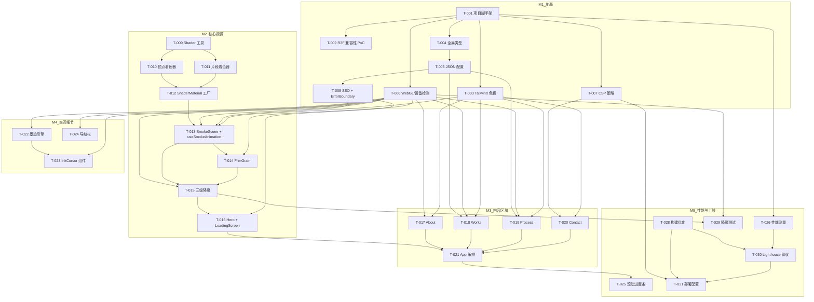

# 开发任务规格文档

## 文档信息
- **功能名称**：lina-perfume-portfolio
- **版本**：1.0
- **创建日期**：2026-04-22
- **作者**：Scrum Master Agent
- **关联故事**：`.boss/lina-perfume-portfolio/prd.md`

## 摘要

> 下游 Agent 请优先阅读本节，需要细节时再查阅完整文档。

- **任务总数**：36 个任务
- **前端任务**：36 个（纯前端项目）
- **后端任务**：0 个
- **关键路径**：T-001 → T-002 → T-003 → T-011 → T-012 → T-021 → T-024 → T-026 → T-031 → T-036
- **预估复杂度**：低 14 / 中 15 / 高 7

---

## 1. 任务概览

### 1.1 统计信息
| 指标 | 数量 |
|------|------|
| 总任务数 | 36 |
| 创建文件 | 52+ |
| 修改文件 | 6（index.html, package.json, tsconfig.json 等） |
| 测试用例 | 28+ |

### 1.2 任务分布
| 复杂度 | 数量 |
|--------|------|
| 低 | 14 |
| 中 | 15 |
| 高 | 7 |

### 1.3 里程碑映射
| 里程碑 | 任务范围 | 天数 | 任务数 |
|--------|----------|------|--------|
| M1: 地基 | T-001 ~ T-008 | 3-4 天 | 8 |
| M2: 核心视觉 | T-009 ~ T-016 | 5-7 天 | 8 |
| M3: 内容区块 | T-017 ~ T-025 | 5-7 天 | 9 |
| M4: 交互细节 | T-026 ~ T-031 | 3-4 天 | 6 |
| M5: 性能与上线 | T-032 ~ T-036 | 3-4 天 | 5 |

---

## 2. 任务详情

### Story: S-001 — M1 地基（项目初始化 + 基础设施）

---

#### Task T-001：项目脚手架初始化

**类型**：创建

**目标文件**：
| 文件路径 | 操作 | 说明 |
|----------|------|------|
| `package.json` | 创建 | 项目配置，声明所有依赖 |
| `tsconfig.json` | 创建 | TypeScript 严格模式配置 |
| `vite.config.ts` | 创建 | Vite 构建 + code splitting 配置 |
| `index.html` | 创建 | HTML 入口 + preload 资源 |
| `.gitignore` | 创建 | Git 忽略规则 |
| `.env.example` | 创建 | 环境变量模板 |

**实现步骤**：

1. **初始化项目并安装依赖**
   ```bash
   npm create vite@latest . -- --template react-ts
   npm install react@19 react-dom@19
   npm install three @react-three/fiber@9 @react-three/drei@10 @react-three/postprocessing@3
   npm install gsap @studio-freight/lenis
   npm install -D @types/three vite-plugin-glsl
   npm install -D vitest @testing-library/react @testing-library/jest-dom jsdom
   npm install -D eslint @typescript-eslint/parser @typescript-eslint/eslint-plugin prettier
   npm install @formspree/react
   ```

2. **配置 tsconfig.json**（严格模式）
   ```json
   {
     "compilerOptions": {
       "target": "ES2020",
       "useDefineForClassFields": true,
       "lib": ["ES2020", "DOM", "DOM.Iterable"],
       "module": "ESNext",
       "skipLibCheck": true,
       "strict": true,
       "noUnusedLocals": true,
       "noUnusedParameters": true,
       "moduleResolution": "bundler",
       "allowImportingTsExtensions": true,
       "isolatedModules": true,
       "moduleDetection": "force",
       "noEmit": true,
       "jsx": "react-jsx",
       "baseUrl": ".",
       "paths": { "@/*": ["src/*"] }
     },
     "include": ["src"]
   }
   ```

3. **配置 vite.config.ts**（code splitting + glsl 插件）
   ```typescript
   import { defineConfig } from 'vite'
   import react from '@vitejs/plugin-react'
   import glsl from 'vite-plugin-glsl'
   import { resolve } from 'path'

   export default defineConfig({
     plugins: [react(), glsl()],
     resolve: { alias: { '@': resolve(__dirname, 'src') } },
     build: {
       rollupOptions: {
         output: {
           manualChunks: {
             'three-core': ['three', '@react-three/fiber'],
             'three-drei': ['@react-three/drei'],
             'postprocessing': ['@react-three/postprocessing'],
             'gsap': ['gsap'],
             'formspree': ['@formspree/react'],
           }
         }
       }
     }
   })
   ```

4. **创建 .env.example**
   ```env
   VITE_FORMSPREE_ENDPOINT=https://formspree.io/f/your-form-id
   ```

**测试用例**：

文件：`tests/setup/vitestSetup.test.ts`

| 用例 ID | 描述 | 类型 |
|---------|------|------|
| TC-001-1 | 项目能成功启动 `npm run dev` | 冒烟测试 |
| TC-001-2 | TypeScript 编译无错误 `npx tsc --noEmit` | 编译检查 |

**复杂度**：低

**依赖**：无

**注意事项**：
- React 19 为前沿版本，安装后需确认无 peer dependency 冲突
- vite-plugin-glsl 确保 .glsl 文件能被正确 import

**完成标志**：
- [ ] `npm run dev` 启动成功，访问 localhost 显示默认页面
- [ ] `npx tsc --noEmit` 通过
- [ ] 目录结构按架构文档创建完成

---

#### Task T-002：React 19 + R3F 兼容性 PoC（BLOCKER-4）

**类型**：创建

**目标文件**：
| 文件路径 | 操作 | 说明 |
|----------|------|------|
| `src/__poc__/R3FPoC.tsx` | 创建 | 最小复现：R3F Canvas + useFrame |
| `src/__poc__/poc-entry.tsx` | 创建 | PoC 入口文件 |

**实现步骤**：

1. **创建最小复现验证 React 19 + R3F v9 兼容性**
   ```tsx
   // src/__poc__/R3FPoC.tsx
   import { Canvas, useFrame } from '@react-three/fiber'
   import { useRef, useState } from 'react'
   import * as THREE from 'three'

   function RotatingBox() {
     const meshRef = useRef<THREE.Mesh>(null!)
     const [hovered, setHovered] = useState(false)

     useFrame((_, delta) => {
       if (meshRef.current) {
         meshRef.current.rotation.x += delta * 0.5
         meshRef.current.rotation.y += delta * 0.3
       }
     })

     return (
       <mesh
         ref={meshRef}
         onPointerOver={() => setHovered(true)}
         onPointerOut={() => setHovered(false)}
       >
         <boxGeometry args={[1, 1, 1]} />
         <meshStandardMaterial color={hovered ? 'hotpink' : 'orange'} />
       </mesh>
     )
   }

   export function R3FPoC() {
     return (
       <div style={{ width: '100vw', height: '100vh' }}>
         <Canvas>
           <ambientLight intensity={0.5} />
           <directionalLight position={[2, 2, 5]} />
           <RotatingBox />
         </Canvas>
      </div>
    )
  }
   ```

2. **验证清单**：
   - [ ] `useFrame` 在 React 19 StrictMode 下正常执行（不双次调用导致异常）
   - [ ] `@react-three/drei` 组件（如 `<Environment />`）能正常渲染
   - [ ] 组件卸载时无 WebGL 内存泄漏（dispose 正常触发）

3. **如不兼容，回退到 React 18 + R3F v8**：
   ```bash
   npm install react@18 react-dom@18 @react-three/fiber@8 @react-three/drei@9
   ```

**测试用例**：

| 用例 ID | 描述 | 类型 |
|---------|------|------|
| TC-002-1 | PoC 页面能渲染旋转立方体 | 冒烟测试 |
| TC-002-2 | useFrame 在 StrictMode 下帧率正常 | 兼容性测试 |
| TC-002-3 | 组件卸载后无控制台 warning | 内存泄漏检查 |

**复杂度**：中

**依赖**：T-001

**注意事项**：
- 这是 **BLOCKER-4**，必须在其他 R3F 任务开始前完成
- 验证通过后删除 `__poc__` 目录，或在 `.gitignore` 中排除

**完成标志**：
- [ ] PoC 验证通过，确认 React 19 + R3F v9 可共存
- [ ] 记录验证结果到项目 README 或决策日志
- [ ] 如回退到 React 18，更新 package.json 并重新验证

---

#### Task T-003：Tailwind CSS 色板与设计令牌

**类型**：创建

**目标文件**：
| 文件路径 | 操作 | 说明 |
|----------|------|------|
| `tailwind.config.ts` | 创建 | Tailwind 配置（色板、字体、自定义动画） |
| `src/styles/tokens.css` | 创建 | CSS 自定义属性（色板、字号、间距） |
| `src/styles/globals.css` | 创建 | Tailwind 指令 + 全局 base 样式 |

**实现步骤**：

1. **配置 Tailwind 色板与字体**
   ```typescript
   // tailwind.config.ts
   import type { Config } from 'tailwindcss'

   export default {
     content: ['./index.html', './src/**/*.{js,ts,jsx,tsx}'],
     theme: {
       extend: {
         colors: {
           ink: '#0A0A0A',
           rice: '#F5F0E8',
           cinnabar: { DEFAULT: '#C9302C', dark: '#8B1A1A', glow: '#FF6B3A' },
         },
         fontFamily: {
           serif: ['Instrument Serif', 'SourceHanSerif', 'serif'],
           sans: ['Inter', 'system-ui', 'sans-serif'],
         },
         animation: {
           'fade-in': 'fadeIn 0.6s ease-out forwards',
           'smoke-drift': 'smokeDrift 8s ease-in-out infinite',
         },
         keyframes: {
           fadeIn: { '0%': { opacity: '0' }, '100%': { opacity: '1' } },
           smokeDrift: {
             '0%, 100%': { transform: 'translate(0, 0) scale(1)' },
             '50%': { transform: 'translate(5px, -10px) scale(1.05)' },
           },
         },
       },
     },
     plugins: [],
   } satisfies Config
   ```

2. **创建 CSS 自定义属性**
   ```css
   /* src/styles/tokens.css */
   :root {
     --color-ink: #0A0A0A;
     --color-rice: #F5F0E8;
     --color-cinnabar: #C9302C;
     --color-cinnabar-dark: #8B1A1A;
     --color-cinnabar-glow: #FF6B3A;
     --font-serif: 'Instrument Serif', 'SourceHanSerif', serif;
     --font-sans: 'Inter', system-ui, sans-serif;
     --spacing-section: 120px;
     --transition-smooth: cubic-bezier(0.25, 0.46, 0.45, 0.94);
   }
   ```

3. **全局样式**
   ```css
   /* src/styles/globals.css */
   @import 'tailwindcss';
   @import './tokens.css';

   @layer base {
     * { cursor: none; }
     html { scroll-behavior: smooth; }
     body {
       background-color: var(--color-ink);
       color: var(--color-rice);
       font-family: var(--font-sans);
       -webkit-font-smoothing: antialiased;
     }
   }
   ```

**测试用例**：

文件：`tests/styles/tokens.test.ts`

| 用例 ID | 描述 | 类型 |
|---------|------|------|
| TC-003-1 | CSS 变量正确定义 | 单元测试 |
| TC-003-2 | Tailwind 色板在组件中可用 | 集成测试 |

```typescript
describe('design tokens', () => {
  it('should have correct color values', () => {
    const root = document.documentElement
    expect(getComputedStyle(root).getPropertyValue('--color-ink').trim()).toBe('#0A0A0A')
  })
})
```

**复杂度**：低

**依赖**：T-001

**完成标志**：
- [ ] `tailwind.config.ts` 包含完整色板和字体配置
- [ ] `globals.css` 正确导入 Tailwind 指令
- [ ] 页面背景色为 `#0A0A0A`

---

#### Task T-004：全局类型定义

**类型**：创建

**目标文件**：
| 文件路径 | 操作 | 说明 |
|----------|------|------|
| `src/types/global.d.ts` | 创建 | .glsl module 声明 |
| `src/types/work.ts` | 创建 | 作品数据类型 |
| `src/types/process.ts` | 创建 | 流程步骤数据类型 |
| `src/types/site.ts` | 创建 | 站点配置类型 |
| `src/types/index.ts` | 创建 | barrel export |

**实现步骤**：

1. **声明 .glsl 模块**
   ```typescript
   // src/types/global.d.ts
   declare module '*.glsl' {
     const value: string
     export default value
   }
   ```

2. **定义作品数据类型**
   ```typescript
   // src/types/work.ts
   export interface WorkNotes {
     top: string[]
     heart: string[]
     base: string[]
   }

   export interface WorkImages {
     thumbnail: string
     gallery: string[]
   }

   export interface Work {
     id: string
     title: string
     subtitle: string
     year: number
     category: string
     notes: WorkNotes
     images: WorkImages
     description: string
     featured: boolean
   }
   ```

3. **定义流程步骤类型**
   ```typescript
   // src/types/process.ts
   export interface ProcessStep {
     step: number
     title: string
     titleEn: string
     description: string
     duration: string
     icon: string
   }
   ```

**测试用例**：

文件：`tests/types/types.test.ts`

| 用例 ID | 描述 | 类型 |
|---------|------|------|
| TC-004-1 | TypeScript 类型编译无错误 | 编译检查 |
| TC-004-2 | Work 类型包含所有必需字段 | 类型测试 |

**复杂度**：低

**依赖**：T-001

**完成标志**：
- [ ] `npx tsc --noEmit` 通过
- [ ] 所有类型有明确的 interface 定义
- [ ] .glsl module 声明正确

---

#### Task T-005：JSON 配置层

**类型**：创建

**目标文件**：
| 文件路径 | 操作 | 说明 |
|----------|------|------|
| `src/config/works.json` | 创建 | 作品数据（2-3 个示例作品） |
| `src/config/process.json` | 创建 | 流程时间轴数据（5 个节点） |
| `src/config/site.json` | 创建 | 全局配置（SEO meta、色板） |
| `src/config/index.ts` | 创建 | 统一导出 + 运行时验证 |

**实现步骤**：

1. **创建作品数据**
   ```json
   {
     "works": [
       {
         "id": "midnight-orchid",
         "title": "午夜兰",
         "subtitle": "Midnight Orchid",
         "year": 2024,
         "category": "木质调",
         "notes": {
           "top": ["佛手柑", "紫苏"],
           "heart": ["墨兰", "沉香"],
           "base": ["檀香", "琥珀"]
         },
         "images": {
           "thumbnail": "/images/works/midnight-orchid-thumb.webp",
           "gallery": [
             "/images/works/midnight-orchid-1.webp",
             "/images/works/midnight-orchid-2.webp"
           ]
         },
         "description": "灵感来自京都夜晚的兰花温室，幽暗中绽放的东方气息",
         "featured": true
       }
     ]
   }
   ```

2. **创建流程数据**
   ```json
   {
     "steps": [
       {
         "step": 1,
         "title": "灵感采集",
         "titleEn": "Inspiration",
         "description": "从自然、文学、记忆中提取嗅觉意象",
         "duration": "1-2 周",
         "icon": "🌿"
       },
       {
         "step": 2,
         "title": "原料甄选",
         "titleEn": "Selection",
         "description": "从全球产地甄选最优质的天然香料",
         "duration": "1 周",
         "icon": "🔬"
       },
       {
         "step": 3,
         "title": "配方调试",
         "titleEn": "Formulation",
         "description": "在调香室中反复调配，寻找完美平衡",
         "duration": "2-4 周",
         "icon": "🧪"
       },
       {
         "step": 4,
         "title": "陈化成熟",
         "titleEn": "Maturation",
         "description": "让香气在时间中沉淀、融合、升华",
         "duration": "4-8 周",
         "icon": "⏳"
       },
       {
         "step": 5,
         "title": "成品发布",
         "titleEn": "Release",
         "description": "装瓶、命名、向世界呈现这缕香气",
         "duration": "1 周",
         "icon": "✨"
       }
     ]
   }
   ```

3. **统一导出**
   ```typescript
   // src/config/index.ts
   import worksData from './works.json'
   import processData from './process.json'
   import siteData from './site.json'
   import type { Work } from '@/types/work'
   import type { ProcessStep } from '@/types/process'

   export const works: Work[] = worksData.works
   export const processSteps: ProcessStep[] = processData.steps
   export const siteConfig = siteData
   ```

**测试用例**：

文件：`tests/config/config.test.ts`

| 用例 ID | 描述 | 类型 |
|---------|------|------|
| TC-005-1 | works.json 所有作品都有必需字段 | 单元测试 |
| TC-005-2 | process.json 至少包含 5 个步骤 | 单元测试 |
| TC-005-3 | 图片路径格式正确 | 单元测试 |

```typescript
import { works, processSteps } from '@/config'

describe('config data', () => {
  it('all works have required fields', () => {
    works.forEach(w => {
      expect(w.id).toBeDefined()
      expect(w.title).toBeDefined()
      expect(w.notes.top.length).toBeGreaterThan(0)
      expect(w.images.thumbnail).toMatch(/^\/images\//)
    })
  })

  it('process has at least 5 steps', () => {
    expect(processSteps.length).toBeGreaterThanOrEqual(5)
  })
})
```

**复杂度**：低

**依赖**：T-004

**完成标志**：
- [ ] JSON 数据结构与 TypeScript 类型匹配
- [ ] 配置导入在组件中可用
- [ ] 所有测试用例通过

---

#### Task T-006：WebGL 能力检测 + 设备类型 Hook

**类型**：创建

**目标文件**：
| 文件路径 | 操作 | 说明 |
|----------|------|------|
| `src/hooks/useWebGLSupport.ts` | 创建 | WebGL 能力检测 → 'full' | 'partial' | 'none' |
| `src/hooks/useDeviceType.ts` | 创建 | 设备类型检测 → 'desktop' | 'tablet' | 'mobile' |
| `src/hooks/useReducedMotion.ts` | 创建 | prefers-reduced-motion 检测 |
| `src/hooks/index.ts` | 创建 | barrel export |

**实现步骤**：

1. **WebGL 能力检测**
   ```typescript
   // src/hooks/useWebGLSupport.ts
   import { useState, useEffect } from 'react'

   export type WebGLTier = 'full' | 'partial' | 'none'

   export function useWebGLSupport(): WebGLTier {
     const [tier, setTier] = useState<WebGLTier>('full')

     useEffect(() => {
       const canvas = document.createElement('canvas')
       const gl = canvas.getContext('webgl2') || canvas.getContext('webgl')

       if (!gl) {
         setTier('none')
         return
       }

       const maxTextureSize = gl.getParameter(gl.MAX_TEXTURE_SIZE)
       const isMobile = /Mobi|Android|iPhone/i.test(navigator.userAgent)
       const isLowEnd = maxTextureSize < 4096

       if (isMobile && isLowEnd) {
         setTier('partial')
       }
     }, [])

     return tier
   }
   ```

2. **设备类型检测**
   ```typescript
   // src/hooks/useDeviceType.ts
   import { useState, useEffect } from 'react'

   export type DeviceType = 'desktop' | 'tablet' | 'mobile'

   export function useDeviceType(): DeviceType {
     const [type, setType] = useState<DeviceType>('desktop')

     useEffect(() => {
       const detect = () => {
         const w = window.innerWidth
         if (w < 768) setType('mobile')
         else if (w < 1024) setType('tablet')
         else setType('desktop')
       }
       detect()
       window.addEventListener('resize', detect)
       return () => window.removeEventListener('resize', detect)
     }, [])

     return type
   }
   ```

3. **Reduced Motion 检测**
   ```typescript
   // src/hooks/useReducedMotion.ts
   import { useState, useEffect } from 'react'

   export function useReducedMotion(): boolean {
     const [reduced, setReduced] = useState(false)

     useEffect(() => {
       const mq = window.matchMedia('(prefers-reduced-motion: reduce)')
       setReduced(mq.matches)
       const handler = (e: MediaQueryListEvent) => setReduced(e.matches)
       mq.addEventListener('change', handler)
       return () => mq.removeEventListener('change', handler)
     }, [])

     return reduced
   }
   ```

**测试用例**：

文件：`tests/hooks/useWebGLSupport.test.ts`

| 用例 ID | 描述 | 类型 |
|---------|------|------|
| TC-006-1 | 无 WebGL 环境返回 'none' | 单元测试 |
| TC-006-2 | 移动端 + 低纹理返回 'partial' | 单元测试 |
| TC-006-3 | useDeviceType 在 375px 返回 'mobile' | 单元测试 |
| TC-006-4 | prefers-reduced-motion 返回正确布尔值 | 单元测试 |

```typescript
import { renderHook } from '@testing-library/react'
import { useReducedMotion } from '@/hooks'

describe('useReducedMotion', () => {
  it('respects system preference', () => {
    Object.defineProperty(window, 'matchMedia', {
      writable: true,
      value: (query: string) => ({
        matches: query.includes('reduce'),
        addEventListener: vi.fn(),
        removeEventListener: vi.fn(),
      }),
    })
    const { result } = renderHook(() => useReducedMotion())
    expect(result.current).toBe(true)
  })
})
```

**复杂度**：中

**依赖**：T-001

**注意事项**：
- `navigator.userAgent` 检测在 Chrome 110+ 中已冻结，但基本判断仍可用
- 后续可考虑用 `navigator.gpu` (WebGPU) 做更精准检测

**完成标志**：
- [ ] 三个 hook 在组件中能正确返回值
- [ ] 单元测试通过
- [ ] resize 事件在组件卸载时正确清理

---

#### Task T-007：CSP 安全策略配置（BLOCKER-1）

**类型**：创建

**目标文件**：
| 文件路径 | 操作 | 说明 |
|----------|------|------|
| `public/_headers` | 创建 | Vercel/Netlify CSP + 安全 Header |
| `vercel.json` | 创建 | Vercel 部署配置 |

**实现步骤**：

1. **创建 _headers 文件**
   ```
   /*
     Content-Security-Policy: default-src 'self'; script-src 'self' 'unsafe-inline' https://fonts.googleapis.com; style-src 'self' 'unsafe-inline' https://fonts.googleapis.com; font-src 'self' https://fonts.gstatic.com data:; img-src 'self' data: blob: https://formspree.io; connect-src https://formspree.io; frame-ancestors 'none'; base-uri 'self'; form-action 'self' https://formspree.io;
     Referrer-Policy: strict-origin-when-cross-origin
     Permissions-Policy: camera=(), microphone=(), geolocation=()
     X-Content-Type-Options: nosniff
     X-Frame-Options: DENY
   ```

2. **创建 vercel.json**
   ```json
   {
     "buildCommand": "vite build",
     "outputDirectory": "dist",
     "headers": [
       {
         "source": "/fonts/(.*)",
         "headers": [{ "key": "Cache-Control", "value": "public, max-age=31536000, immutable" }]
       },
       {
         "source": "/images/(.*)",
         "headers": [{ "key": "Cache-Control", "value": "public, max-age=86400, stale-while-revalidate=604800" }]
       }
     ]
   }
   ```

**测试用例**：

| 用例 ID | 描述 | 类型 |
|---------|------|------|
| TC-007-1 | _headers 文件包含所有必需 CSP 指令 | 静态检查 |
| TC-007-2 | CSP 包含 frame-ancestors 'none' | 静态检查 |
| TC-007-3 | CSP 包含 referrer-policy | 静态检查 |
| TC-007-4 | CSP 包含 permissions-policy | 静态检查 |

**复杂度**：低

**依赖**：T-001

**注意事项**：
- 这是 **BLOCKER-1**，必须在部署前完成
- CSP 中 `script-src` 包含 `'unsafe-inline'` 是因 Vite 开发模式需要，生产环境可考虑 nonce 方案

**完成标志**：
- [ ] `_headers` 文件包含完整 CSP
- [ ] `vercel.json` 包含缓存策略
- [ ] 无 CSP 语法错误

---

#### Task T-008：SEO Meta + Error Boundary 基础

**类型**：创建

**目标文件**：
| 文件路径 | 操作 | 说明 |
|----------|------|------|
| `src/components/SEO/SEO.tsx` | 创建 | Meta 标签注入组件 |
| `src/components/ErrorBoundary/ErrorBoundary.tsx` | 创建 | React Error Boundary（SUGGESTION-1） |
| `index.html` | 修改 | 添加基础 meta 标签 + preload |

**实现步骤**：

1. **创建 SEO 组件**
   ```tsx
   // src/components/SEO/SEO.tsx
   import { useEffect } from 'react'
   import { siteConfig } from '@/config'

   interface SEOProps {
     title?: string
     description?: string
     image?: string
   }

   export function SEO({ title, description, image }: SEOProps) {
     useEffect(() => {
       document.title = title || siteConfig.title
       const setMeta = (name: string, content: string, attr = 'name') => {
         let el = document.querySelector(`meta[${attr}="${name}"]`)
         if (!el) {
           el = document.createElement('meta')
           el.setAttribute(attr, name)
           document.head.appendChild(el)
         }
         el.setAttribute('content', content)
       }
       setMeta('description', description || siteConfig.description)
       setMeta('og:title', title || siteConfig.title, 'property')
       setMeta('og:description', description || siteConfig.description, 'property')
       if (image) setMeta('og:image', image, 'property')
     }, [title, description, image])

     return null
   }
   ```

2. **创建 Error Boundary**
   ```tsx
   // src/components/ErrorBoundary/ErrorBoundary.tsx
   import { Component, type ReactNode } from 'react'

   interface Props { children: ReactNode; fallback?: ReactNode }
   interface State { hasError: boolean; error: Error | null }

   export class ErrorBoundary extends Component<Props, State> {
     state: State = { hasError: false, error: null }

     static getDerivedStateFromError(error: Error): State {
       return { hasError: true, error }
     }

     render() {
       if (this.state.hasError) {
         return this.props.fallback || (
           <div className="flex items-center justify-center h-screen bg-ink text-rice">
             <p className="font-serif text-xl">Something went wrong.</p>
           </div>
         )
       }
       return this.props.children
     }
   }
   ```

3. **更新 index.html 基础 meta**
   ```html
   <!DOCTYPE html>
   <html lang="zh-CN">
   <head>
     <meta charset="UTF-8" />
     <meta name="viewport" content="width=device-width, initial-scale=1.0" />
     <title>Lina — 东方草本调香师</title>
     <meta name="description" content="独立调香师 Lina 的个人作品集 — 东方草本香艺" />
     <link rel="preconnect" href="https://fonts.googleapis.com" />
     <link rel="preconnect" href="https://fonts.gstatic.com" crossorigin />
     <link href="https://fonts.googleapis.com/css2?family=Instrument+Serif:ital@0;1&family=Inter:wght@300;400;500&display=swap" rel="stylesheet" />
   </head>
   <body>
     <div id="root"></div>
     <script type="module" src="/src/main.tsx"></script>
   </body>
   </html>
   ```

**测试用例**：

文件：`tests/components/SEO.test.tsx`

| 用例 ID | 描述 | 类型 |
|---------|------|------|
| TC-008-1 | SEO 组件设置正确的 document.title | 组件测试 |
| TC-008-2 | SEO 组件设置正确的 og:title | 组件测试 |
| TC-008-3 | Error Boundary 捕获子组件错误并渲染 fallback | 组件测试 |

**复杂度**：中

**依赖**：T-005

**注意事项**：
- Error Boundary 是 SUGGESTION-1，防止三套渲染系统中任何一个崩溃导致白屏
- SEO 组件使用 `useEffect` 而非 React Helmet，避免额外依赖

**完成标志**：
- [ ] SEO 组件能动态更新 meta 标签
- [ ] Error Boundary 能捕获并优雅降级
- [ ] index.html 包含完整的 SEO meta

---

### Story: S-002 — M2 核心视觉（Hero Shader + 降级体系）

---

#### Task T-009：全局 Shader 工具模块

**类型**：创建

**目标文件**：
| 文件路径 | 操作 | 说明 |
|----------|------|------|
| `src/shaders/common/noise.glsl` | 创建 | Simplex/Perlin noise GLSL 函数 |
| `src/shaders/common/colors.glsl` | 创建 | 色板常量 GLSL |
| `src/shaders/utils/createShaderMaterial.ts` | 创建 | ShaderMaterial 创建工具函数 |

**实现步骤**：

1. **创建噪声 GLSL**
   ```glsl
   // src/shaders/common/noise.glsl
   // Simplex 3D noise — Ian McEwan, Ashima Arts
   vec3 mod289(vec3 x) { return x - floor(x * (1.0 / 289.0)) * 289.0; }
   vec4 mod289(vec4 x) { return x - floor(x * (1.0 / 289.0)) * 289.0; }
   vec4 permute(vec4 x) { return mod289(((x * 34.0) + 1.0) * x); }
   vec4 taylorInvSqrt(vec4 r) { return 1.79284291400159 - 0.85373472095314 * r; }

   float snoise(vec3 v) {
     const vec2 C = vec2(1.0 / 6.0, 1.0 / 3.0);
     const vec4 D = vec4(0.0, 0.5, 1.0, 2.0);
     vec3 i = floor(v + dot(v, C.yyy));
     vec3 x0 = v - i + dot(i, C.xxx);
     vec3 g = step(x0.yzx, x0.xyz);
     vec3 l = 1.0 - g;
     vec3 i1 = min(g.xyz, l.zxy);
     vec3 i2 = max(g.xyz, l.zxy);
     vec3 x1 = x0 - i1 + C.xxx;
     vec3 x2 = x0 - i2 + C.yyy;
     vec3 x3 = x0 - D.yyy;
     i = mod289(i);
     vec4 p = permute(permute(permute(
       i.z + vec4(0.0, i1.z, i2.z, 1.0))
       + i.y + vec4(0.0, i1.y, i2.y, 1.0))
       + i.x + vec4(0.0, i1.x, i2.x, 1.0));
     float n_ = 0.142857142857;
     vec3 ns = n_ * D.wyz - D.xzx;
     vec4 j = p - 49.0 * floor(p * ns.z * ns.z);
     vec4 x_ = floor(j * ns.z);
     vec4 y_ = floor(j - 7.0 * x_);
     vec4 x = x_ * ns.x + ns.yyyy;
     vec4 y = y_ * ns.x + ns.yyyy;
     vec4 h = 1.0 - abs(x) - abs(y);
     vec4 b0 = vec4(x.xy, y.xy);
     vec4 b1 = vec4(x.zw, y.zw);
     vec4 s0 = floor(b0) * 2.0 + 1.0;
     vec4 s1 = floor(b1) * 2.0 + 1.0;
     vec4 sh = -step(h, vec4(0.0));
     vec4 a0 = b0.xzyw + s0.xzyw * sh.xxyy;
     vec4 a1 = b1.xzyw + s1.xzyw * sh.zzww;
     vec3 p0 = vec3(a0.xy, h.x);
     vec3 p1 = vec3(a0.zw, h.y);
     vec3 p2 = vec3(a1.xy, h.z);
     vec3 p3 = vec3(a1.zw, h.w);
     vec4 norm = taylorInvSqrt(vec4(dot(p0,p0), dot(p1,p1), dot(p2,p2), dot(p3,p3)));
     p0 *= norm.x; p1 *= norm.y; p2 *= norm.z; p3 *= norm.w;
     vec4 m = max(0.6 - vec4(dot(x0,x0), dot(x1,x1), dot(x2,x2), dot(x3,x3)), 0.0);
     m = m * m;
     return 42.0 * dot(m*m, vec4(dot(p0,x0), dot(p1,x1), dot(p2,x2), dot(p3,x3)));
   }
   ```

2. **创建色板 GLSL**
   ```glsl
   // src/shaders/common/colors.glsl
   // 朱砂红 #C9302C → vec3(0.788, 0.188, 0.173)
   // 深红 #8B1A1A → vec3(0.545, 0.102, 0.102)
   // 橙红光晕 #FF6B3A → vec3(1.0, 0.42, 0.227)
   // 墨黑 #0A0A0A → vec3(0.039, 0.039, 0.039)

   vec3 COLOR_CINNABAR = vec3(0.788, 0.188, 0.173);
   vec3 COLOR_CINNABAR_DARK = vec3(0.545, 0.102, 0.102);
   vec3 COLOR_GLOW = vec3(1.0, 0.42, 0.227);
   vec3 COLOR_INK = vec3(0.039, 0.039, 0.039);
   ```

**测试用例**：

| 用例 ID | 描述 | 类型 |
|---------|------|------|
| TC-009-1 | GLSL 文件能被 vite-plugin-glsl 正确导入 | 集成测试 |
| TC-009-2 | createShaderMaterial 返回有效 ShaderMaterial | 单元测试 |

**复杂度**：中

**依赖**：T-001

**完成标志**：
- [ ] GLSL 文件能通过 `import` 引入为字符串
- [ ] `createShaderMaterial` 函数能创建有效的 Three.js ShaderMaterial
- [ ] 噪声函数在 shader 中编译通过

---

#### Task T-010：烟雾 Shader 顶点着色器

**类型**：创建

**目标文件**：
| 文件路径 | 操作 | 说明 |
|----------|------|------|
| `src/shaders/smoke/smoke.vert.glsl` | 创建 | 顶点着色器 — 全屏 quad |

**实现步骤**：

1. **创建顶点着色器（全屏 quad pass-through）**
   ```glsl
   // src/shaders/smoke/smoke.vert.glsl
   // 全屏四边形 — 将 UV 坐标传递给片段着色器

   varying vec2 vUv;

   void main() {
     vUv = uv;
     gl_Position = projectionMatrix * modelViewMatrix * vec4(position, 1.0);
   }
   ```

**测试用例**：

| 用例 ID | 描述 | 类型 |
|---------|------|------|
| TC-010-1 | 顶点着色器编译无错误 | 运行时测试 |

**复杂度**：低

**依赖**：T-009

**完成标志**：
- [ ] 顶点着色器在 Three.js 中编译通过
- [ ] vUv 正确传递到片段着色器

---

#### Task T-011：烟雾 Shader 片段着色器（核心）

**类型**：创建

**目标文件**：
| 文件路径 | 操作 | 说明 |
|----------|------|------|
| `src/shaders/smoke/smoke.frag.glsl` | 创建 | 片段着色器 — FBM 噪声 + 体积烟雾 + 颜色渐变 |

**实现步骤**：

1. **创建烟雾片段着色器**
   ```glsl
   // src/shaders/smoke/smoke.frag.glsl
   // 朱砂烟雾 — 基于 FBM 噪声的体积烟雾模拟
   // 8 秒无缝循环，颜色从朱砂红渐变至深红

   precision highp float;

   #include ../common/noise.glsl
   #include ../common/colors.glsl

   uniform float uTime;       // 时间驱动（0-8 秒循环）
   uniform float uOpacity;    // 透明度（ScrollTrigger 驱动）
   uniform vec2 uResolution;  // 屏幕分辨率
   uniform float uMobile;     // 移动端标记（降低 FBM 层数）

   varying vec2 vUv;

   // FBM — Fractal Brownian Motion
   // 桌面端 4 层，移动端 2 层
   float fbm(vec3 p) {
     float value = 0.0;
     float amplitude = 0.5;
     float frequency = 1.0;
     int octaves = int(mix(4.0, 2.0, uMobile)); // 移动端减少层数

     for (int i = 0; i < 4; i++) {
       if (i >= octaves) break;
       value += amplitude * snoise(p * frequency);
       amplitude *= 0.5;
       frequency *= 2.0;
     }
     return value;
   }

   // 烟雾密度 — 基于 UV + time 计算
   float smokeDensity(vec2 uv, float time) {
     // 3D 噪声采样，时间作为第三维度
     vec3 p = vec3(uv * 3.0, time * 0.15);

     // 多层噪声叠加，产生自然的烟雾纹理
     float density = fbm(p);
     density += 0.5 * fbm(p * 2.0 + vec3(time * 0.05));

     // 归一化到 0-1
     density = density * 0.5 + 0.5;

     // 边缘衰减 — 从中心向四周 soft falloff
     float dist = length(uv - 0.5) * 2.0;
     float edgeFade = smoothstep(1.0, 0.3, dist);

     // 底部更浓，顶部渐稀
     float verticalFade = smoothstep(0.0, 0.8, 1.0 - uv.y);

     return density * edgeFade * verticalFade;
   }

   void main() {
     // 8 秒无缝循环
     float time = fract(uTime / 8.0) * 8.0;

     // 计算烟雾密度
     float density = smokeDensity(vUv, time);

     // 颜色渐变：底部朱砂红 → 顶部深红
     vec3 color = mix(COLOR_CINNABAR, COLOR_CINNABAR_DARK, 1.0 - vUv.y);

     // 右下角橙红光晕
     float glowDist = length(vUv - vec2(0.85, 0.15));
     float glow = smoothstep(0.5, 0.0, glowDist) * 0.3 * density;
     color += COLOR_GLOW * glow;

     // 最终颜色 = 烟雾色 * 密度 * 透明度
     float alpha = density * uOpacity;

     // 与墨黑底色混合
     color = mix(COLOR_INK, color, alpha);

     gl_FragColor = vec4(color, 1.0);
   }
   ```

**测试用例**：

| 用例 ID | 描述 | 类型 |
|---------|------|------|
| TC-011-1 | Shader 在 Three.js 中编译通过 | 运行时测试 |
| TC-011-2 | uTime 驱动动画循环 | 视觉测试 |
| TC-011-3 | uMobile=1.0 时减少 FBM 层数 | 性能测试 |

**复杂度**：高

**依赖**：T-010, T-009

**注意事项**：
- 这是项目的**核心视觉资产**，预计需要 3-5 天反复调优参数
- FBM 层数是性能关键：桌面 4 层，移动端 2 层
- 8 秒循环通过 `fract(uTime / 8.0)` 实现无缝 loop

**完成标志**：
- [ ] Shader 编译通过，无 GLSL 错误
- [ ] 烟雾效果在全屏 Canvas 上可见
- [ ] 8 秒循环流畅无跳跃
- [ ] 移动端 FBM 层数减少生效

---

#### Task T-012：SmokeShaderMaterial 工厂

**类型**：创建

**目标文件**：
| 文件路径 | 操作 | 说明 |
|----------|------|------|
| `src/shaders/smoke/SmokeShaderMaterial.ts` | 创建 | ShaderMaterial 工厂 — uniforms 定义 + 类型 |
| `src/shaders/smoke/smoke.types.ts` | 创建 | Shader uniforms 类型定义 |

**实现步骤**：

1. **定义 uniforms 类型**
   ```typescript
   // src/shaders/smoke/smoke.types.ts
   import type { Uniform } from 'three'

   export interface SmokeUniforms {
     uTime: Uniform<number>
     uOpacity: Uniform<number>
     uResolution: Uniform<[number, number]>
     uMobile: Uniform<number>
   }
   ```

2. **创建 ShaderMaterial 工厂**
   ```typescript
   // src/shaders/smoke/SmokeShaderMaterial.ts
   import { ShaderMaterial, Uniform } from 'three'
   import smokeVertexShader from './smoke.vert.glsl'
   import smokeFragmentShader from './smoke.frag.glsl'
   import type { SmokeUniforms } from './smoke.types'

   export function createSmokeShaderMaterial(isMobile: boolean): ShaderMaterial {
     const uniforms: SmokeUniforms = {
       uTime: new Uniform(0),
       uOpacity: new Uniform(0),
       uResolution: new Uniform([window.innerWidth, window.innerHeight]),
       uMobile: new Uniform(isMobile ? 1.0 : 0.0),
     }

     return new ShaderMaterial({
       uniforms,
       vertexShader: smokeVertexShader,
       fragmentShader: smokeFragmentShader,
       depthWrite: false,
       depthTest: false,
     })
   }
   ```

**测试用例**：

| 用例 ID | 描述 | 类型 |
|---------|------|------|
| TC-012-1 | createSmokeShaderMaterial 返回有效 ShaderMaterial | 单元测试 |
| TC-012-2 | uniforms 包含所有必需字段 | 单元测试 |
| TC-012-3 | isMobile 参数正确设置 uMobile | 单元测试 |

```typescript
import { createSmokeShaderMaterial } from '@/shaders/smoke/SmokeShaderMaterial'

describe('SmokeShaderMaterial', () => {
  it('creates a valid ShaderMaterial with all uniforms', () => {
    const mat = createSmokeShaderMaterial(false)
    expect(mat.uniforms.uTime).toBeDefined()
    expect(mat.uniforms.uOpacity).toBeDefined()
    expect(mat.uniforms.uResolution).toBeDefined()
    expect(mat.uniforms.uMobile.value).toBe(0.0)
  })

  it('sets uMobile for mobile devices', () => {
    const mat = createSmokeShaderMaterial(true)
    expect(mat.uniforms.uMobile.value).toBe(1.0)
  })
})
```

**复杂度**：低

**依赖**：T-010, T-011

**完成标志**：
- [ ] 工厂函数能创建带正确 uniforms 的 ShaderMaterial
- [ ] TypeScript 类型定义完整
- [ ] 单元测试通过

---

#### Task T-013：SmokeScene R3F 组件 + useSmokeAnimation

**类型**：创建

**目标文件**：
| 文件路径 | 操作 | 说明 |
|----------|------|------|
| `src/sections/Hero/useSmokeAnimation.ts` | 创建 | GSAP → R3F 桥接 hook |
| `src/sections/Hero/SmokeScene.tsx` | 创建 | R3F Canvas 包裹组件 |

**实现步骤**：

1. **GSAP → R3F 桥接 hook**
   ```typescript
   // src/sections/Hero/useSmokeAnimation.ts
   import { useEffect, useRef } from 'react'
   import gsap from 'gsap'
   import { ScrollTrigger } from 'gsap/ScrollTrigger'
   import { useReducedMotion } from '@/hooks'

   gsap.registerPlugin(ScrollTrigger)

   export function useSmokeAnimation() {
     const smokeProgress = useRef({ value: 0 })
     const reducedMotion = useReducedMotion()

     useEffect(() => {
       if (reducedMotion) return

       const ctx = gsap.context(() => {
         gsap.timeline({
           scrollTrigger: {
             trigger: '#hero',
             start: 'top top',
             end: 'bottom top',
             scrub: 0.5,
           }
         }).to(smokeProgress.current, {
           value: 1,
           duration: 1,
           ease: 'power2.out',
         })
       })

       return () => ctx.revert()
     }, [reducedMotion])

     return smokeProgress
   }
   ```

2. **R3F 场景组件**
   ```tsx
   // src/sections/Hero/SmokeScene.tsx
   import { useRef } from 'react'
   import { Canvas, useFrame, useThree } from '@react-three/fiber'
   import { ShaderMaterial } from 'three'
   import { createSmokeShaderMaterial } from '@/shaders/smoke/SmokeShaderMaterial'
   import { useSmokeAnimation } from './useSmokeAnimation'
   import { useDeviceType } from '@/hooks'

   function SmokeMesh() {
     const materialRef = useRef<ShaderMaterial>(null!)
     const { size } = useThree()
     const progress = useSmokeAnimation()
     const deviceType = useDeviceType()
     const isMobile = deviceType === 'mobile'

     useFrame((_, delta) => {
       if (materialRef.current) {
         materialRef.current.uniforms.uTime.value += delta
         materialRef.current.uniforms.uOpacity.value =
           THREE.MathUtils.lerp(
             materialRef.current.uniforms.uOpacity.value,
             1 - progress.current.value,
             delta * 4
           )
         materialRef.current.uniforms.uResolution.value = [size.width, size.height]
       }
     })

     return (
       <mesh>
         <planeGeometry args={[2, 2]} />
         <primitive object={createSmokeShaderMaterial(isMobile)} ref={materialRef} />
       </mesh>
     )
   }

   export function SmokeScene() {
     return (
       <Canvas
         style={{ position: 'fixed', top: 0, left: 0, width: '100%', height: '100%', zIndex: 0 }}
         camera={{ position: [0, 0, 1], fov: 75 }}
         gl={{ antialias: false, alpha: false }}
       >
         <SmokeMesh />
       </Canvas>
     )
   }
   ```

**测试用例**：

| 用例 ID | 描述 | 类型 |
|---------|------|------|
| TC-013-1 | SmokeScene 能渲染 Canvas | 组件测试 |
| TC-013-2 | useSmokeAnimation 在 reducedMotion 时跳过 | 单元测试 |
| TC-013-3 | GSAP context 正确清理 | 单元测试 |

**复杂度**：高

**依赖**：T-006, T-008, T-012, T-003（需先安装 GSAP）

**注意事项**：
- 这是 **GSAP + R3F 管线隔离** 的关键实现
- GSAP 只写 ref 值，useFrame 负责插值到 Three.js
- `gsap.context()` 确保 React StrictMode 下正确清理

**完成标志**：
- [ ] SmokeScene 渲染全屏 Canvas
- [ ] 烟雾随滚动淡出
- [ ] reducedMotion 用户看到静态效果
- [ ] 组件卸载时无 GSAP 泄漏

---

#### Task T-014：FilmGrain 后处理组件

**类型**：创建

**目标文件**：
| 文件路径 | 操作 | 说明 |
|----------|------|------|
| `src/components/FilmGrain/FilmGrain.tsx` | 创建 | R3F 后处理 — 胶片颗粒效果 |

**实现步骤**：

1. **创建 FilmGrain 组件**
   ```tsx
   // src/components/FilmGrain/FilmGrain.tsx
   import { EffectComposer, Noise } from '@react-three/postprocessing'
   import { useReducedMotion } from '@/hooks'

   export function FilmGrain() {
     const reducedMotion = useReducedMotion()

     if (reducedMotion) return null

     return (
       <EffectComposer disableNormalPass multisampling={0}>
         <Noise opacity={0.08} premultiply />
       </EffectComposer>
     )
   }
   ```

**测试用例**：

| 用例 ID | 描述 | 类型 |
|---------|------|------|
| TC-014-1 | FilmGrain 在正常模式下渲染 | 组件测试 |
| TC-014-2 | reducedMotion 时返回 null | 单元测试 |

**复杂度**：低

**依赖**：T-006

**完成标志**：
- [ ] FilmGrain 叠加在 SmokeScene 上
- [ ] reducedMotion 时不渲染
- [ ] 颗粒透明度合适（不抢主体）

---

#### Task T-015：三级降级体系实现

**类型**：创建

**目标文件**：
| 文件路径 | 操作 | 说明 |
|----------|------|------|
| `src/sections/Hero/HeroBackground.tsx` | 创建 | 降级容器 — 根据 WebGL tier 选择渲染策略 |
| `public/images/hero-fallback.webp` | 创建 | WebGL 降级静态图（预渲染） |

**实现步骤**：

1. **创建降级容器组件**
   ```tsx
   // src/sections/Hero/HeroBackground.tsx
   import { Suspense, lazy } from 'react'
   import { useWebGLSupport, useReducedMotion } from '@/hooks'

   // 懒加载 R3F 组件
   const SmokeScene = lazy(() => import('./SmokeScene').then(m => ({ default: m.SmokeScene })))
   const FilmGrain = lazy(() => import('@/components/FilmGrain/FilmGrain').then(m => ({ default: m.FilmGrain })))

   export function HeroBackground() {
     const webglTier = useWebGLSupport()
     const reducedMotion = useReducedMotion()

     // none: 静态背景
     if (webglTier === 'none' || reducedMotion) {
       return (
         <div
           className="fixed inset-0 z-0"
           style={{
             background: 'linear-gradient(180deg, #8B1A1A 0%, #0A0A0A 60%, #0A0A0A 100%)',
             backgroundImage: 'url(/images/hero-fallback.webp)',
             backgroundSize: 'cover',
             backgroundPosition: 'center',
           }}
         />
       )
     }

     // partial / full: WebGL 渲染
     return (
       <Suspense fallback={
         <div className="fixed inset-0 z-0 bg-ink" />
       }>
         <SmokeScene />
         {webglTier === 'full' && <FilmGrain />}
       </Suspense>
     )
   }
   ```

**测试用例**：

| 用例 ID | 描述 | 类型 |
|---------|------|------|
| TC-015-1 | none tier 渲染静态背景 | 组件测试 |
| TC-015-2 | full tier 渲染 SmokeScene + FilmGrain | 组件测试 |
| TC-015-3 | partial tier 渲染 SmokeScene 但不渲染 FilmGrain | 组件测试 |

**复杂度**：中

**依赖**：T-006, T-013, T-014

**完成标志**：
- [ ] 三种 tier 对应三种渲染策略
- [ ] 静态降级背景图视觉效果可接受
- [ ] Suspense fallback 不闪烁

---

#### Task T-016：Hero 区块 + 标题文字 + LoadingScreen

**类型**：创建

**目标文件**：
| 文件路径 | 操作 | 说明 |
|----------|------|------|
| `src/sections/Hero/Hero.tsx` | 创建 | Hero 区块主组件（烟雾背景 + 标题） |
| `src/components/LoadingScreen/LoadingScreen.tsx` | 创建 | 加载过渡动画 |
| `src/App.tsx` | 创建 | 根组件（区块编排 + LoadingScreen） |
| `src/main.tsx` | 创建 | 应用入口 |

**实现步骤**：

1. **创建 LoadingScreen**
   ```tsx
   // src/components/LoadingScreen/LoadingScreen.tsx
   import { useEffect, useState } from 'react'

   interface LoadingScreenProps {
     onComplete: () => void
   }

   export function LoadingScreen({ onComplete }: LoadingScreenProps) {
     const [visible, setVisible] = useState(true)

     useEffect(() => {
       // 3 秒超时自动跳过
       const timer = setTimeout(() => {
         setVisible(false)
         onComplete()
       }, 3000)
       return () => clearTimeout(timer)
     }, [onComplete])

     const handleDone = () => {
       setVisible(false)
       onComplete()
     }

     return (
       <div
         className={`fixed inset-0 z-50 bg-ink flex items-center justify-center transition-opacity duration-300 ${
           visible ? 'opacity-100' : 'opacity-0 pointer-events-none'
         }`}
         onTransitionEnd={handleDone}
       >
         <h1 className="font-serif text-rice text-4xl tracking-widest animate-fade-in">
           Lina
         </h1>
       </div>
     )
   }
   ```

2. **创建 Hero 主组件**
   ```tsx
   // src/sections/Hero/Hero.tsx
   import { HeroBackground } from './HeroBackground'

   export function Hero() {
     return (
       <section id="hero" className="relative h-screen w-full overflow-hidden">
         <HeroBackground />
         {/* 标题文字叠加在烟雾之上 */}
         <div className="relative z-10 flex flex-col items-center justify-center h-full text-center px-4">
           <h1 className="font-serif text-rice text-5xl md:text-7xl lg:text-8xl tracking-wider">
             Lina
           </h1>
           <p className="font-sans text-rice/60 text-sm md:text-base mt-4 tracking-widest uppercase">
             东方草本调香师
           </p>
           <p className="font-sans text-rice/40 text-xs mt-2 tracking-wider">
             Eastern Herbology Perfumer
           </p>
         </div>
       </section>
     )
   }
   ```

3. **创建 App.tsx 根组件**
   ```tsx
   // src/App.tsx
   import { useState, useCallback } from 'react'
   import { ErrorBoundary } from '@/components/ErrorBoundary/ErrorBoundary'
   import { LoadingScreen } from '@/components/LoadingScreen/LoadingScreen'
   import { SEO } from '@/components/SEO/SEO'
   import { Hero } from '@/sections/Hero/Hero'
   import { InkCursor } from '@/components/InkCursor/InkCursor' // M4 任务

   export function App() {
     const [loaded, setLoaded] = useState(false)

     const handleLoad = useCallback(() => setLoaded(true), [])

     return (
       <ErrorBoundary>
         <SEO />
         {!loaded && <LoadingScreen onComplete={handleLoad} />}
         <main className={`transition-opacity duration-500 ${loaded ? 'opacity-100' : 'opacity-0'}`}>
           <Hero />
           {/* 其他 section 将在 M3 添加 */}
         </main>
         <InkCursor />
       </ErrorBoundary>
     )
   }
   ```

**测试用例**：

| 用例 ID | 描述 | 类型 |
|---------|------|------|
| TC-016-1 | LoadingScreen 3 秒后自动消失 | 组件测试 |
| TC-016-2 | Hero 标题文字在烟雾上方可见 | 视觉测试 |
| TC-016-3 | App 根组件正确编排子组件 | 组件测试 |

**复杂度**：中

**依赖**：T-015, T-008

**完成标志**：
- [ ] 加载动画在 3 秒内或 Shader 就绪后消失
- [ ] Hero 标题文字清晰可读
- [ ] App 根组件正确编排所有区块
- [ ] 超时机制正常工作

---

### Story: S-003 — M3 内容区块（About / Works / Process / Contact）

---

#### Task T-017：About 区块 — 个人故事

**类型**：创建

**目标文件**：
| 文件路径 | 操作 | 说明 |
|----------|------|------|
| `src/sections/About/About.tsx` | 创建 | About 区块主组件 |
| `src/sections/About/AboutImage.tsx` | 创建 | 右侧黑白照片组件 |
| `src/sections/About/useAboutAnimation.ts` | 创建 | 文字淡入动画 hook |

**实现步骤**：

1. **创建 About 动画 hook**
   ```typescript
   // src/sections/About/useAboutAnimation.ts
   import { useEffect, useRef } from 'react'
   import gsap from 'gsap'
   import { ScrollTrigger } from 'gsap/ScrollTrigger'
   import { useReducedMotion } from '@/hooks'

   gsap.registerPlugin(ScrollTrigger)

   export function useAboutAnimation(containerRef: React.RefObject<HTMLElement | null>) {
     const reducedMotion = useReducedMotion()

     useEffect(() => {
       if (reducedMotion || !containerRef.current) return

       const ctx = gsap.context(() => {
         // 文字逐行淡入
         gsap.from('.about-text', {
           opacity: 0,
           y: 30,
           duration: 0.8,
           stagger: 0.15,
           ease: 'power2.out',
           scrollTrigger: {
             trigger: containerRef.current,
             start: 'top 80%',
             end: 'bottom 20%',
             scrub: 1,
           }
         })

         // 图片 parallax
         gsap.from('.about-image', {
           scale: 1.1,
           opacity: 0,
           duration: 1,
           scrollTrigger: {
             trigger: containerRef.current,
             start: 'top 70%',
             end: 'bottom 30%',
             scrub: 1,
           }
         })
       })

       return () => ctx.revert()
     }, [reducedMotion, containerRef])
   }
   ```

2. **创建 About 主组件**
   ```tsx
   // src/sections/About/About.tsx
   import { useRef } from 'react'
   import { useAboutAnimation } from './useAboutAnimation'
   import { AboutImage } from './AboutImage'

   export function About() {
     const containerRef = useRef<HTMLDivElement>(null)
     useAboutAnimation(containerRef)

     return (
       <section id="about" ref={containerRef} className="relative py-32 px-6 md:px-12" style={{ backgroundColor: 'var(--color-rice)', color: 'var(--color-ink)' }}>
         <div className="max-w-6xl mx-auto grid md:grid-cols-[60%_40%] gap-12 items-center">
           <div className="space-y-6">
             <h2 className="font-serif text-4xl md:text-5xl about-text">京都八年</h2>
             <p className="font-serif text-lg leading-relaxed about-text">
               在京都的八年里，Lina 跟随传统调香师学习"东方草本"的精髓。
               从山林采集植物，在茶室中辨别气息，最终形成了独特的调香哲学。
             </p>
             <p className="font-sans text-sm text-ink/60 leading-relaxed about-text">
               八年京都修行，她相信香气是连接人与自然的桥梁。
               每一款香水，都是一段关于土地、季节与记忆的叙事。
             </p>
           </div>
           <div className="about-image">
             <AboutImage />
           </div>
         </div>
       </section>
     )
   }
   ```

3. **AboutImage 组件**
   ```tsx
   // src/sections/About/AboutImage.tsx
   export function AboutImage() {
     return (
       <div className="relative aspect-[3/4] overflow-hidden rounded-sm">
         
       </div>
     )
   }
   ```

**测试用例**：

| 用例 ID | 描述 | 类型 |
|---------|------|------|
| TC-017-1 | About 区块正确渲染文字和图片 | 组件测试 |
| TC-017-2 | reducedMotion 时动画跳过 | 单元测试 |
| TC-017-3 | 图片有正确的 alt 文本 | 无障碍测试 |

**复杂度**：中

**依赖**：T-006, T-003, T-005

**完成标志**：
- [ ] 桌面端左文右图布局正确
- [ ] 滚动时文字淡入、图片 parallax
- [ ] 底色为暖米白 #F5F0E8
- [ ] 图片黑白处理 + 右侧羽化

---

#### Task T-018：Works 区块 — 卡片网格

**类型**：创建

**目标文件**：
| 文件路径 | 操作 | 说明 |
|----------|------|------|
| `src/sections/Works/Works.tsx` | 创建 | Works 区块主组件 — 卡片网格 |
| `src/sections/Works/WorkCard.tsx` | 创建 | 单张作品卡片 |
| `src/sections/Works/useRevealAnimation.ts` | 创建 | clip-path 揭幕动画 hook |

**实现步骤**：

1. **clip-path 揭幕动画 hook**
   ```typescript
   // src/sections/Works/useRevealAnimation.ts
   import { useEffect } from 'react'
   import gsap from 'gsap'
   import { ScrollTrigger } from 'gsap/ScrollTrigger'
   import { useReducedMotion } from '@/hooks'

   gsap.registerPlugin(ScrollTrigger)

   export function useRevealAnimation() {
     const reducedMotion = useReducedMotion()

     useEffect(() => {
       if (reducedMotion) return

       const ctx = gsap.context(() => {
         gsap.utils.toArray<HTMLElement>('.work-card').forEach((card, i) => {
           // 初始状态：clip-path 完全隐藏
           gsap.set(card, { clipPath: 'inset(0 100% 0 0)' })

           gsap.to(card, {
             clipPath: 'inset(0 0% 0 0)',
             duration: 0.8,
             ease: 'power3.inOut',
             scrollTrigger: {
               trigger: card,
               start: 'top 85%',
               toggleActions: 'play none none none',
             },
           })
         })
       })

       return () => ctx.revert()
     }, [reducedMotion])
   }
   ```

2. **WorkCard 组件**
   ```tsx
   // src/sections/Works/WorkCard.tsx
   import type { Work } from '@/types/work'

   interface WorkCardProps {
     work: Work
   }

   export function WorkCard({ work }: WorkCardProps) {
     return (
       <article className="work-card group relative overflow-hidden bg-ink/5">
         <div className="aspect-[4/5] overflow-hidden">
           
         </div>
         <div className="p-4">
           <h3 className="font-serif text-xl text-cinnabar">{work.title}</h3>
           <p className="font-sans text-xs text-rice/50 uppercase tracking-wider mt-1">{work.subtitle}</p>
           <p className="font-sans text-sm text-rice/70 mt-2 line-clamp-2">{work.description}</p>
           {/* Hover 显示香调 */}
           <div className="absolute inset-0 bg-ink/90 flex flex-col justify-center p-6 opacity-0 group-hover:opacity-100 transition-opacity duration-300">
             <h4 className="font-serif text-2xl text-cinnabar mb-4">{work.title}</h4>
             <div className="space-y-2 text-sm">
               <p className="text-rice/80"><span className="text-cinnabar">前调：</span>{work.notes.top.join('、')}</p>
               <p className="text-rice/80"><span className="text-cinnabar">中调：</span>{work.notes.heart.join('、')}</p>
               <p className="text-rice/80"><span className="text-cinnabar">后调：</span>{work.notes.base.join('、')}</p>
             </div>
           </div>
         </div>
       </article>
     )
   }
   ```

3. **Works 主组件**
   ```tsx
   // src/sections/Works/Works.tsx
   import { useEffect, useRef } from 'react'
   import { works } from '@/config'
   import { WorkCard } from './WorkCard'
   import { useRevealAnimation } from './useRevealAnimation'

   export function Works() {
     const sectionRef = useRef<HTMLDivElement>(null)
     useRevealAnimation()

     return (
       <section id="works" ref={sectionRef} className="py-32 px-6 md:px-12 bg-ink">
         <div className="max-w-6xl mx-auto">
           <h2 className="font-serif text-4xl md:text-5xl text-rice mb-16 text-center">作品</h2>
           <div className="grid grid-cols-1 md:grid-cols-2 lg:grid-cols-3 gap-8">
             {works.map(work => (
               <WorkCard key={work.id} work={work} />
             ))}
           </div>
         </div>
       </section>
     )
   }
   ```

**测试用例**：

| 用例 ID | 描述 | 类型 |
|---------|------|------|
| TC-018-1 | 作品卡片从 JSON 数据正确渲染 | 组件测试 |
| TC-018-2 | 卡片 hover 显示香调信息 | 交互测试 |
| TC-018-3 | 响应式布局（1/2/3 列）正确 | 视觉测试 |

**复杂度**：中

**依赖**：T-005, T-006, T-003

**完成标志**：
- [ ] 卡片网格布局正确（桌面 3 列，平板 2 列，移动 1 列）
- [ ] clip-path 从左向右揭幕动画流畅
- [ ] Hover 显示香调信息
- [ ] 卡片从 JSON 数据渲染

---

#### Task T-019：Process 区块 — 横向滚动时间轴

**类型**：创建

**目标文件**：
| 文件路径 | 操作 | 说明 |
|----------|------|------|
| `src/sections/Process/Process.tsx` | 创建 | Process 区块主组件 — 横向滚动容器 |
| `src/sections/Process/TimelineItem.tsx` | 创建 | 单流程节点 |
| `src/sections/Process/useHorizontalScroll.ts` | 创建 | GSAP pin + scrub 横向滚动 hook |

**实现步骤**：

1. **横向滚动 hook**
   ```typescript
   // src/sections/Process/useHorizontalScroll.ts
   import { useEffect, useRef } from 'react'
   import gsap from 'gsap'
   import { ScrollTrigger } from 'gsap/ScrollTrigger'
   import { useDeviceType, useReducedMotion } from '@/hooks'

   gsap.registerPlugin(ScrollTrigger)

   export function useHorizontalScroll(containerRef: React.RefObject<HTMLDivElement | null>) {
     const deviceType = useDeviceType()
     const reducedMotion = useReducedMotion()

     useEffect(() => {
       if (deviceType === 'mobile' || reducedMotion || !containerRef.current) return

       const container = containerRef.current
       const scrollWidth = container.scrollWidth - window.innerWidth

       const ctx = gsap.context(() => {
         gsap.to(container, {
           x: -scrollWidth,
           ease: 'none',
           scrollTrigger: {
             trigger: '#process-section',
             pin: true,
             scrub: 1,
             end: () => `+=${scrollWidth}`,
             invalidateOnRefresh: true,
             anticipatePin: 1,
           }
         })

         // 节点依次淡入
         gsap.utils.toArray<HTMLElement>('.timeline-item').forEach((item, i) => {
           gsap.from(item, {
             opacity: 0,
             y: 40,
             duration: 0.6,
             scrollTrigger: {
               trigger: item,
               containerAnimation: gsap.getById('horizontal') as any,
               start: 'left 80%',
               toggleActions: 'play none none none',
             }
           })
         })
       })

       return () => ctx.revert()
     }, [deviceType, reducedMotion])
   }
   ```

2. **TimelineItem 组件**
   ```tsx
   // src/sections/Process/TimelineItem.tsx
   import type { ProcessStep } from '@/types/process'

   interface TimelineItemProps {
     step: ProcessStep
     isLast?: boolean
   }

   export function TimelineItem({ step, isLast }: TimelineItemProps) {
     return (
       <div className="timeline-item flex-shrink-0 w-72 md:w-80 px-4">
         <div className="flex items-start gap-4">
           <div className="flex flex-col items-center">
             <span className="text-3xl">{step.icon}</span>
             <div className="w-px h-16 bg-cinnabar/30 mt-2" />
           </div>
           <div>
             <span className="text-xs text-cinnabar/60 font-sans tracking-wider">STEP {step.step}</span>
             <h3 className="font-serif text-xl text-rice mt-1">{step.title}</h3>
             <p className="font-sans text-xs text-rice/50 uppercase tracking-wider">{step.titleEn}</p>
             <p className="font-sans text-sm text-rice/70 mt-2">{step.description}</p>
             <span className="text-xs text-rice/40 mt-2 block">{step.duration}</span>
           </div>
         </div>
         {!isLast && <div className="w-full h-px bg-cinnabar/20 mt-8 mx-2" />}
       </div>
     )
   }
   ```

3. **Process 主组件**
   ```tsx
   // src/sections/Process/Process.tsx
   import { useRef } from 'react'
   import { processSteps } from '@/config'
   import { TimelineItem } from './TimelineItem'
   import { useHorizontalScroll } from './useHorizontalScroll'
   import { useDeviceType } from '@/hooks'

   export function Process() {
     const containerRef = useRef<HTMLDivElement>(null)
     const deviceType = useDeviceType()
     useHorizontalScroll(containerRef)

     const isMobile = deviceType === 'mobile'

     return (
       <section id="process-section" className="py-32 bg-ink overflow-hidden">
         <h2 className="font-serif text-4xl md:text-5xl text-rice mb-16 text-center px-6">调香流程</h2>
         {isMobile ? (
           // 移动端：垂直堆叠
           <div className="max-w-md mx-auto space-y-8 px-6">
             {processSteps.map((step, i) => (
               <TimelineItem key={step.step} step={step} isLast={i === processSteps.length - 1} />
             ))}
           </div>
         ) : (
           // 桌面端：横向滚动
           <div
             ref={containerRef}
             className="flex items-start gap-4 px-12"
             style={{ width: `${processSteps.length * 320}px` }}
           >
             {processSteps.map((step, i) => (
               <TimelineItem key={step.step} step={step} isLast={i === processSteps.length - 1} />
             ))}
           </div>
         )}
       </section>
     )
   }
   ```

**测试用例**：

| 用例 ID | 描述 | 类型 |
|---------|------|------|
| TC-019-1 | 桌面端横向滚动 + pin 生效 | E2E 测试 |
| TC-019-2 | 移动端垂直堆叠布局 | 组件测试 |
| TC-019-3 | 至少渲染 5 个流程节点 | 组件测试 |
| TC-019-4 | iOS Safari 上 pin 无闪烁 | 手动测试 |

**复杂度**：高

**依赖**：T-005, T-006, T-003

**注意事项**：
- 这是**最复杂的 GSAP 动画**，需重点测试 iOS Safari
- `anticipatePin: 1` 和 `invalidateOnRefresh` 是关键参数
- 如 iOS Safari 仍有问题，备选方案：CSS scroll-snap

**完成标志**：
- [ ] 桌面端横向滚动 + pin 正常
- [ ] 移动端垂直堆叠
- [ ] 节点间连线随滚动显现
- [ ] iOS Safari 测试通过

---

#### Task T-020：Contact 区块 — 表单 + 成功动画

**类型**：创建

**目标文件**：
| 文件路径 | 操作 | 说明 |
|----------|------|------|
| `src/sections/Contact/Contact.tsx` | 创建 | Contact 区块主组件 |
| `src/sections/Contact/BookingForm.tsx` | 创建 | formSpree 表单组件 |
| `src/sections/Contact/useFormSubmission.ts` | 创建 | 表单提交 hook |

**实现步骤**：

1. **表单提交 hook**
   ```typescript
   // src/sections/Contact/useFormSubmission.ts
   import { useState, useCallback } from 'react'

   interface FormState {
     name: string
     email: string
     type: string
     message: string
   }

   type FormStatus = 'idle' | 'submitting' | 'success' | 'error'

   interface UseFormSubmissionReturn {
     form: FormState
     status: FormStatus
     error: string | null
     updateField: (field: keyof FormState, value: string) => void
     validate: () => boolean
     submit: () => Promise<void>
   }

   const EMAIL_RE = /^[^\s@]+@[^\s@]+\.[^\s@]+$/

   export function useFormSubmission(): UseFormSubmissionReturn {
     const [form, setForm] = useState<FormState>({ name: '', email: '', type: '', message: '' })
     const [status, setStatus] = useState<FormStatus>('idle')
     const [error, setError] = useState<string | null>(null)

     const updateField = useCallback((field: keyof FormState, value: string) => {
       setForm(prev => ({ ...prev, [field]: value }))
     }, [])

     const validate = useCallback((): boolean => {
       if (!form.name.trim()) { setError('请输入姓名'); return false }
       if (!EMAIL_RE.test(form.email)) { setError('请输入有效的邮箱地址'); return false }
       if (!form.type) { setError('请选择咨询类型'); return false }
       setError(null)
       return true
     }, [form])

     const submit = useCallback(async () => {
       if (!validate()) return

       setStatus('submitting')
       try {
         const endpoint = import.meta.env.VITE_FORMSPREE_ENDPOINT
         const response = await fetch(endpoint, {
           method: 'POST',
           headers: { 'Content-Type': 'application/json', Accept: 'application/json' },
           body: JSON.stringify(form),
         })

         if (!response.ok) throw new Error('提交失败')
         setStatus('success')
       } catch {
         setStatus('error')
         setError('网络错误，请稍后重试')
       }
     }, [form, validate])

     return { form, status, error, updateField, validate, submit }
   }
   ```

2. **BookingForm 组件**
   ```tsx
   // src/sections/Contact/BookingForm.tsx
   import { useFormSubmission } from './useFormSubmission'

   export function BookingForm() {
     const { form, status, error, updateField, submit } = useFormSubmission()

     if (status === 'success') {
       return (
         <div className="text-center py-12 animate-fade-in">
           <p className="font-serif text-2xl text-rice mb-4">「香气是时间的艺术，耐心是最美的配方。」</p>
           <p className="font-sans text-sm text-rice/60">Lina 将在 24 小时内回复您</p>
         </div>
       )
     }

     return (
       <form onSubmit={(e) => { e.preventDefault(); submit() }} className="space-y-6 max-w-lg mx-auto">
         <div>
           <label htmlFor="name" className="block text-sm text-rice/60 mb-1">姓名 *</label>
           <input
             id="name" type="text" required
             value={form.name} onChange={e => updateField('name', e.target.value)}
             className="w-full bg-transparent border-b border-rice/20 text-rice py-2 focus:border-cinnabar outline-none transition-colors"
           />
         </div>
         <div>
           <label htmlFor="email" className="block text-sm text-rice/60 mb-1">邮箱 *</label>
           <input
             id="email" type="email" required
             value={form.email} onChange={e => updateField('email', e.target.value)}
             className="w-full bg-transparent border-b border-rice/20 text-rice py-2 focus:border-cinnabar outline-none transition-colors"
           />
         </div>
         <div>
           <label htmlFor="type" className="block text-sm text-rice/60 mb-1">咨询类型 *</label>
           <select
             id="type" required
             value={form.type} onChange={e => updateField('type', e.target.value)}
             className="w-full bg-ink border-b border-rice/20 text-rice py-2 focus:border-cinnabar outline-none"
           >
             <option value="">请选择</option>
             <option value="personal">个人定制</option>
             <option value="brand">品牌合作</option>
             <option value="media">媒体采访</option>
             <option value="other">其他</option>
           </select>
         </div>
         <div>
           <label htmlFor="message" className="block text-sm text-rice/60 mb-1">留言</label>
           <textarea
             id="message" rows={4}
             value={form.message} onChange={e => updateField('message', e.target.value)}
             className="w-full bg-transparent border-b border-rice/20 text-rice py-2 focus:border-cinnabar outline-none transition-colors resize-none"
           />
         </div>
         {error && <p className="text-cinnabar text-sm">{error}</p>}
         <button
           type="submit" disabled={status === 'submitting'}
           className="w-full py-3 bg-cinnabar text-rice font-sans text-sm tracking-wider uppercase hover:bg-cinnabar-dark disabled:opacity-50 transition-colors"
         >
           {status === 'submitting' ? '发送中...' : '发送'}
         </button>
       </form>
     )
   }
   ```

3. **Contact 主组件**
   ```tsx
   // src/sections/Contact/Contact.tsx
   import { useRef, useEffect } from 'react'
   import gsap from 'gsap'
   import { ScrollTrigger } from 'gsap/ScrollTrigger'
   import { BookingForm } from './BookingForm'

   gsap.registerPlugin(ScrollTrigger)

   export function Contact() {
     const sectionRef = useRef<HTMLDivElement>(null)

     useEffect(() => {
       if (!sectionRef.current) return
       const ctx = gsap.context(() => {
         gsap.from('#contact-form', {
           opacity: 0, y: 40, duration: 0.8,
           scrollTrigger: { trigger: sectionRef.current, start: 'top 80%' }
         })
       })
       return () => ctx.revert()
     }, [])

     return (
       <section id="contact" ref={sectionRef} className="py-32 px-6 bg-ink">
         <div className="max-w-2xl mx-auto text-center">
           <h2 className="font-serif text-4xl md:text-5xl text-rice mb-4">预约咨询</h2>
           <p className="font-sans text-sm text-rice/50 mb-12">每一段香气叙事，都从一次对话开始</p>
           <div id="contact-form"><BookingForm /></div>
         </div>
       </section>
     )
   }
   ```

**测试用例**：

文件：`tests/sections/Contact/useFormSubmission.test.ts`

| 用例 ID | 描述 | 类型 |
|---------|------|------|
| TC-020-1 | 表单验证：空姓名返回错误 | 单元测试 |
| TC-020-2 | 表单验证：无效邮箱返回错误 | 单元测试 |
| TC-020-3 | 表单验证：合法输入返回 true | 单元测试 |
| TC-020-4 | 提交成功时 status 变为 'success' | 异步单元测试 |
| TC-020-5 | 提交失败时 status 变为 'error' | 异步单元测试 |

```typescript
import { renderHook, act } from '@testing-library/react'
import { useFormSubmission } from '@/sections/Contact/useFormSubmission'

describe('useFormSubmission', () => {
  it('validates empty name', () => {
    const { result } = renderHook(() => useFormSubmission())
    act(() => result.current.updateField('name', ''))
    act(() => result.current.updateField('email', 'test@test.com'))
    act(() => result.current.updateField('type', 'personal'))
    expect(result.current.validate()).toBe(false)
    expect(result.current.error).toBe('请输入姓名')
  })

  it('validates invalid email', () => {
    const { result } = renderHook(() => useFormSubmission())
    act(() => result.current.updateField('name', 'Test'))
    act(() => result.current.updateField('email', 'invalid'))
    act(() => result.current.updateField('type', 'personal'))
    expect(result.current.validate()).toBe(false)
    expect(result.current.error).toBe('请输入有效的邮箱地址')
  })
})
```

**复杂度**：中

**依赖**：T-007（环境变量）, T-003

**注意事项**：
- formSpree 端点通过 `import.meta.env.VITE_FORMSPREE_ENDPOINT` 注入
- 不使用 @formspree/react SDK，用原生 fetch 更灵活（便于自定义成功动画）
- 提交失败时显示友好错误提示 + 允许重试

**完成标志**：
- [ ] 表单验证逻辑正确
- [ ] 提交成功显示调香箴言
- [ ] 提交失败显示错误 + 可重试
- [ ] formSpree 端点使用环境变量

---

#### Task T-021：App.tsx 完整区块编排

**类型**：修改

**目标文件**：
| 文件路径 | 操作 | 说明 |
|----------|------|------|
| `src/App.tsx` | 修改 | 集成所有 5 个区块 + 页脚 |

**实现步骤**：

1. **更新 App.tsx 编排所有区块**
   ```tsx
   // src/App.tsx
   import { useState, useCallback } from 'react'
   import { ErrorBoundary } from '@/components/ErrorBoundary/ErrorBoundary'
   import { LoadingScreen } from '@/components/LoadingScreen/LoadingScreen'
   import { SEO } from '@/components/SEO/SEO'
   import { Hero } from '@/sections/Hero/Hero'
   import { About } from '@/sections/About/About'
   import { Works } from '@/sections/Works/Works'
   import { Process } from '@/sections/Process/Process'
   import { Contact } from '@/sections/Contact/Contact'

   export function App() {
     const [loaded, setLoaded] = useState(false)
     const handleLoad = useCallback(() => setLoaded(true), [])

     return (
       <ErrorBoundary>
         <SEO />
         {!loaded && <LoadingScreen onComplete={handleLoad} />}
         <main className={`transition-opacity duration-500 ${loaded ? 'opacity-100' : 'opacity-0'}`}>
           <Hero />
           <About />
           <Works />
           <Process />
           <Contact />
           {/* 页脚 */}
           <footer className="py-8 px-6 bg-ink text-center">
             <p className="font-sans text-xs text-rice/30">
               © {new Date().getFullYear()} Lina — 东方草本调香师
             </p>
           </footer>
         </main>
       </ErrorBoundary>
     )
   }
   ```

**测试用例**：

| 用例 ID | 描述 | 类型 |
|---------|------|------|
| TC-021-1 | App 渲染所有 5 个区块 | 组件测试 |
| TC-021-2 | 区块按正确顺序排列 | 组件测试 |
| TC-021-3 | 页脚存在且包含版权信息 | 组件测试 |

**复杂度**：低

**依赖**：T-016, T-017, T-018, T-019, T-020

**完成标志**：
- [ ] 所有 5 个区块在页面上可见
- [ ] 区块顺序正确：Hero → About → Works → Process → Contact
- [ ] 页脚渲染正常

---

### Story: S-004 — M4 交互细节（墨迹光标 + 导航 + 滚动进度）

---

#### Task T-022：墨迹光标 — Canvas 2D 墨迹引擎

**类型**：创建

**目标文件**：
| 文件路径 | 操作 | 说明 |
|----------|------|------|
| `src/components/InkCursor/inkTrail.ts` | 创建 | Canvas 2D 墨迹绘制纯函数 |
| `src/components/InkCursor/useMousePosition.ts` | 创建 | 鼠标位置追踪 hook |

**实现步骤**：

1. **鼠标位置 hook**
   ```typescript
   // src/components/InkCursor/useMousePosition.ts
   import { useState, useEffect } from 'react'

   export function useMousePosition() {
     const [pos, setPos] = useState({ x: -100, y: -100 })

     useEffect(() => {
       const handler = (e: MouseEvent) => setPos({ x: e.clientX, y: e.clientY })
       window.addEventListener('mousemove', handler)
       return () => window.removeEventListener('mousemove', handler)
     }, [])

     return pos
   }
   ```

2. **墨迹绘制引擎**
   ```typescript
   // src/components/InkCursor/inkTrail.ts
   interface TrailPoint {
     x: number
     y: number
     age: number
     size: number
   }

   const MAX_TRAIL = 20
   const MAX_AGE = 800 // ms

   let trail: TrailPoint[] = []

   export function addTrailPoint(x: number, y: number, now: number) {
     trail.push({ x, y, age: 0, size: 12 })
     if (trail.length > MAX_TRAIL) trail.shift()
   }

   export function renderInkTrail(ctx: CanvasRenderingContext2D, now: number, canvasWidth: number, canvasHeight: number) {
     ctx.clearRect(0, 0, canvasWidth, canvasHeight)

     trail = trail.filter(p => {
       p.age += 16 // ~60fps
       return p.age < MAX_AGE
     })

     // 绘制轨迹点（渐隐）
     trail.forEach((p, i) => {
       const alpha = 1 - p.age / MAX_AGE
       const size = p.size * alpha
       if (size < 0.5) return

       ctx.beginPath()
       ctx.arc(p.x, p.y, size, 0, Math.PI * 2)
       ctx.fillStyle = `rgba(10, 10, 10, ${alpha * 0.3})`
       ctx.fill()
     })

     // 绘制主墨点
     const current = trail[trail.length - 1]
     if (current) {
       ctx.beginPath()
       ctx.arc(current.x, current.y, 6, 0, Math.PI * 2)
       ctx.fillStyle = 'rgba(10, 10, 10, 0.8)'
       ctx.fill()
     }
   }

   export function resetTrail() {
     trail = []
   }
   ```

**测试用例**：

| 用例 ID | 描述 | 类型 |
|---------|------|------|
| TC-022-1 | addTrailPoint 添加点不超过 MAX_TRAIL | 单元测试 |
| TC-022-2 | renderInkTrail 清除超龄点 | 单元测试 |
| TC-022-3 | resetTrail 清空轨迹 | 单元测试 |

**复杂度**：中

**依赖**：T-006

**注意事项**：
- 轨迹点上限 20 个，超过则移除最旧的
- 使用 `globalCompositeOperation = 'multiply'` 可在实际渲染时实现墨迹叠加
- `prefers-reduced-motion` 时仅渲染主墨点，不绘制轨迹

**完成标志**：
- [ ] 墨迹引擎纯函数可独立测试
- [ ] 轨迹点渐隐效果正常
- [ ] 性能稳定（≤ 20 个点）

---

#### Task T-023：墨迹光标 — React 组件

**类型**：创建

**目标文件**：
| 文件路径 | 操作 | 说明 |
|----------|------|------|
| `src/components/InkCursor/InkCursor.tsx` | 创建 | 墨迹光标 React 组件 |

**实现步骤**：

1. **创建 InkCursor 组件**
   ```tsx
   // src/components/InkCursor/InkCursor.tsx
   import { useRef, useEffect } from 'react'
   import { useMousePosition } from './useMousePosition'
   import { addTrailPoint, renderInkTrail } from './inkTrail'
   import { useReducedMotion, useDeviceType } from '@/hooks'

   export function InkCursor() {
     const canvasRef = useRef<HTMLCanvasElement>(null)
     const { x, y } = useMousePosition()
     const reducedMotion = useReducedMotion()
     const deviceType = useDeviceType()

     // 移动端禁用
     if (deviceType === 'mobile') return null

     useEffect(() => {
       const canvas = canvasRef.current
       if (!canvas) return

       const ctx = canvas.getContext('2d')!
       const width = Math.min(window.innerWidth, 1920)
       const height = window.innerHeight
       canvas.width = width
       canvas.height = height

       let rafId: number

       const draw = (now: number) => {
         addTrailPoint(x, y, now)
         renderInkTrail(ctx, now, width, height)
         rafId = requestAnimationFrame(draw)
       }

       rafId = requestAnimationFrame(draw)
       return () => cancelAnimationFrame(rafId)
     }, [x, y, reducedMotion])

     return (
       <canvas
         ref={canvasRef}
         className="fixed inset-0 z-[9999] pointer-events-none"
         style={{ cursor: 'none' }}
       />
     )
   }
   ```

**测试用例**：

| 用例 ID | 描述 | 类型 |
|---------|------|------|
| TC-023-1 | 移动端返回 null（不渲染） | 组件测试 |
| TC-023-2 | 桌面端渲染 Canvas 元素 | 组件测试 |
| TC-023-3 | Canvas 有 pointer-events: none | 样式测试 |

**复杂度**：中

**依赖**：T-022, T-006

**完成标志**：
- [ ] 桌面端显示墨迹光标
- [ ] 移动端不渲染
- [ ] 光标层 z-index 最高且不阻挡交互

---

#### Task T-024：全局导航栏

**类型**：创建

**目标文件**：
| 文件路径 | 操作 | 说明 |
|----------|------|------|
| `src/components/Navigation/Navigation.tsx` | 创建 | 固定导航栏 + 滚动显隐 |
| `src/components/Navigation/useNavScroll.ts` | 创建 | 滚动显隐 hook |

**实现步骤**：

1. **滚动显隐 hook**
   ```typescript
   // src/components/Navigation/useNavScroll.ts
   import { useState, useEffect, useCallback } from 'react'

   export function useNavScroll() {
     const [visible, setVisible] = useState(true)
     const [lastScrollY, setLastScrollY] = useState(0)
     const [activeSection, setActiveSection] = useState('hero')

     useEffect(() => {
       let ticking = false

       const handleScroll = () => {
         if (!ticking) {
           requestAnimationFrame(() => {
             const currentY = window.scrollY
             setVisible(currentY < lastScrollY || currentY < 100)
             setLastScrollY(currentY)
             ticking = false
           })
           ticking = true
         }
       }

       window.addEventListener('scroll', handleScroll, { passive: true })
       return () => window.removeEventListener('scroll', handleScroll)
     }, [lastScrollY])

     // IntersectionObserver 跟踪当前区域
     useEffect(() => {
       const sections = ['hero', 'about', 'works', 'process', 'contact']
       const observers: IntersectionObserver[] = []

       sections.forEach(id => {
         const el = document.getElementById(id)
         if (!el) return
         const observer = new IntersectionObserver(
           ([entry]) => { if (entry.isIntersecting) setActiveSection(id) },
           { threshold: 0.3 }
         )
         observer.observe(el)
         observers.push(observer)
       })

       return () => observers.forEach(o => o.disconnect())
     }, [])

     return { visible, activeSection }
   }
   ```

2. **导航组件**
   ```tsx
   // src/components/Navigation/Navigation.tsx
   import { useState } from 'react'
   import { useNavScroll } from './useNavScroll'
   import { useDeviceType } from '@/hooks'

   const navItems = [
     { id: 'about', label: 'About' },
     { id: 'works', label: 'Works' },
     { id: 'process', label: 'Process' },
     { id: 'contact', label: 'Contact' },
   ]

   export function Navigation() {
     const { visible, activeSection } = useNavScroll()
     const deviceType = useDeviceType()
     const [menuOpen, setMenuOpen] = useState(false)
     const isMobile = deviceType === 'mobile'

     const scrollTo = (id: string) => {
       document.getElementById(id)?.scrollIntoView({ behavior: 'smooth' })
       setMenuOpen(false)
     }

     return (
       <>
         <nav
           className={`fixed top-0 left-0 right-0 z-40 flex items-center justify-between px-6 md:px-12 py-4 transition-all duration-300 ${
             visible ? 'opacity-100 translate-y-0' : 'opacity-0 -translate-y-full'
           }`}
         >
           {/* Logo */}
           <button onClick={() => scrollTo('hero')} className="font-serif text-2xl text-rice hover:text-cinnabar transition-colors">
             Lina
           </button>

           {/* Desktop links */}
           {!isMobile && (
             <div className="flex gap-8">
               {navItems.map(item => (
                 <button
                   key={item.id}
                   onClick={() => scrollTo(item.id)}
                   className={`font-sans text-xs uppercase tracking-wider transition-colors ${
                     activeSection === item.id ? 'text-cinnabar' : 'text-rice/70 hover:text-rice'
                   }`}
                 >
                   {item.label}
                 </button>
               ))}
             </div>
           )}

           {/* Mobile hamburger */}
           {isMobile && (
             <button onClick={() => setMenuOpen(true)} className="text-rice">
               <svg width="24" height="24" viewBox="0 0 24 24" fill="none" stroke="currentColor" strokeWidth="1.5">
                 <line x1="3" y1="6" x2="21" y2="6" /><line x1="3" y1="12" x2="21" y2="12" /><line x1="3" y1="18" x2="21" y2="18" />
               </svg>
             </button>
           )}
         </nav>

         {/* Mobile fullscreen overlay */}
         {isMobile && menuOpen && (
           <div className="fixed inset-0 z-50 bg-ink flex flex-col items-center justify-center gap-8">
             <button onClick={() => setMenuOpen(false)} className="absolute top-4 right-6 text-rice text-2xl">&times;</button>
             {navItems.map(item => (
               <button
                 key={item.id}
                 onClick={() => scrollTo(item.id)}
                 className="font-serif text-3xl text-rice hover:text-cinnabar transition-colors"
               >
                 {item.label}
               </button>
             ))}
           </div>
         )}
       </>
     )
   }
   ```

**测试用例**：

| 用例 ID | 描述 | 类型 |
|---------|------|------|
| TC-024-1 | 向下滚动 100px 后导航隐藏 | E2E 测试 |
| TC-024-2 | 向上滚动时导航显示 | E2E 测试 |
| TC-024-3 | 当前区域导航项高亮 | 组件测试 |
| TC-024-4 | 移动端汉堡菜单打开/关闭 | 组件测试 |

**复杂度**：中

**依赖**：T-006

**完成标志**：
- [ ] 导航固定在顶部
- [ ] 向下滚动隐藏、向上滚动显示
- [ ] 当前区域项高亮
- [ ] 移动端汉堡菜单正常

---

#### Task T-025：滚动进度指示器（惊喜需求）

**类型**：创建

**目标文件**：
| 文件路径 | 操作 | 说明 |
|----------|------|------|
| `src/hooks/useScrollProgress.ts` | 创建 | 全局滚动进度 hook |
| `src/components/ScrollProgress/ScrollProgress.tsx` | 创建 | 香字形 SVG 进度条 |

**实现步骤**：

1. **滚动进度 hook**
   ```typescript
   // src/hooks/useScrollProgress.ts
   import { useState, useEffect } from 'react'

   export function useScrollProgress(): number {
     const [progress, setProgress] = useState(0)

     useEffect(() => {
       const handler = () => {
         const scrollTop = window.scrollY
         const docHeight = document.documentElement.scrollHeight - window.innerHeight
         setProgress(docHeight > 0 ? scrollTop / docHeight : 0)
       }
       window.addEventListener('scroll', handler, { passive: true })
       return () => window.removeEventListener('scroll', handler)
     }, [])

     return progress
   }
   ```

2. **SVG 进度条组件**
   ```tsx
   // src/components/ScrollProgress/ScrollProgress.tsx
   import { useScrollProgress } from '@/hooks'

   export function ScrollProgress() {
     const progress = useScrollProgress()
     const strokeLength = 60
     const filledLength = strokeLength * progress

     return (
       <div className="fixed right-4 top-1/2 -translate-y-1/2 z-30 opacity-30 hover:opacity-60 transition-opacity">
         <svg width="16" height="80" viewBox="0 0 16 80" className="drop-shadow-sm">
           {/* 香的轮廓 */}
           <rect x="7" y="10" width="2" height={strokeLength} fill="rgba(245,240,232,0.2)" rx="1" />
           {/* 烟雾填充效果 */}
           <rect x="7" y={10 + strokeLength - filledLength} width="2" height={filledLength} fill="#C9302C" rx="1" />
           {/* 顶部烟 */}
           <circle cx="8" cy="8" r="2" fill="#C9302C" opacity={0.3 + progress * 0.5} />
         </svg>
       </div>
     )
   }
   ```

**测试用例**：

| 用例 ID | 描述 | 类型 |
|---------|------|------|
| TC-025-1 | 页面顶部进度为 0 | 单元测试 |
| TC-025-2 | 页面底部进度为 1 | 单元测试 |
| TC-025-3 | SVG 渲染正常 | 组件测试 |

**复杂度**：中

**依赖**：无

**完成标志**：
- [ ] 右侧固定显示进度条
- [ ] 滚动时进度条实时更新
- [ ] SVG 香字形视觉效果美观

---

### Story: S-005 — M5 性能与上线

---

#### Task T-026：性能测量工具

**类型**：创建

**目标文件**：
| 文件路径 | 操作 | 说明 |
|----------|------|------|
| `src/utils/perf.ts` | 创建 | LCP、FCP、CLS 测量上报 |

**实现步骤**：

1. **创建性能测量工具**
   ```typescript
   // src/utils/perf.ts
   import { onLCP, onFCP, onCLS } from 'web-vitals'

   export function initPerfReporting() {
     onLCP(report => console.log('[Perf] LCP:', Math.round(report.value), 'ms'))
     onFCP(report => console.log('[Perf] FCP:', Math.round(report.value), 'ms'))
     onCLS(report => console.log('[Perf] CLS:', report.value.toFixed(3)))
   }

   // 测量 Hero 动画帧率
   export function measureFPS(duration = 2000): Promise<number> {
     return new Promise(resolve => {
       let frames = 0
       const start = performance.now()
       const tick = () => {
         frames++
         if (performance.now() - start < duration) {
           requestAnimationFrame(tick)
         } else {
           resolve(Math.round(frames / (duration / 1000)))
         }
       }
       requestAnimationFrame(tick)
     })
   }
   ```

2. **在 main.tsx 中初始化**
   ```typescript
   // src/main.tsx
   import { StrictMode } from 'react'
   import { createRoot } from 'react-dom/client'
   import { App } from './App'
   import { initPerfReporting } from './utils/perf'
   import './styles/globals.css'

   createRoot(document.getElementById('root')!).render(
     <StrictMode>
       <App />
     </StrictMode>
   )

   // 开发环境下打印性能指标
   if (import.meta.env.DEV) {
     initPerfReporting()
   }
   ```

**测试用例**：

| 用例 ID | 描述 | 类型 |
|---------|------|------|
| TC-026-1 | initPerfReporting 注册 web-vitals 回调 | 单元测试 |
| TC-026-2 | measureFPS 返回合理帧率值 | 单元测试 |

**复杂度**：低

**依赖**：T-001（需安装 web-vitals）

**完成标志**：
- [ ] 开发环境控制台打印 LCP / FCP / CLS
- [ ] measureFPS 能正确测量帧率

---

#### Task T-027：图片资源占位 + 字体子集

**类型**：创建

**目标文件**：
| 文件路径 | 操作 | 说明 |
|----------|------|------|
| `public/images/hero-fallback.webp` | 创建 | Hero 降级静态图 |
| `public/images/about.webp` | 创建 | About 区工作室照片占位 |
| `public/images/works/` | 创建 | 作品图片目录 |
| `public/fonts/source-han-serif-subset.woff2` | 创建 | 中文体子集 |
| `public/favicon.ico` | 创建 | 网站图标 |

**实现步骤**：

1. **创建占位图片**（使用纯色或渐变 SVG 转 WebP）
   ```bash
   # 使用 ImageMagick 创建占位图
   convert -size 1920x1080 xc:'#0A0A0A' -fill '#C9302C' -draw "circle 1600,900 1600,800" public/images/hero-fallback.webp
   convert -size 800x1067 xc:'#F5F0E8' public/images/about.webp
   ```

2. **字体子集准备**
   - 使用 `glyphhanger` 或 `fonttools pyftsubset` 生成思源宋体子集
   - 控制子集 ≤ 200KB

**测试用例**：

| 用例 ID | 描述 | 类型 |
|---------|------|------|
| TC-027-1 | 所有占位图片存在且可加载 | 静态检查 |
| TC-027-2 | Hero 降级图片 < 100KB | 静态检查 |
| TC-027-3 | 字体子集 < 200KB | 静态检查 |

**复杂度**：低

**依赖**：T-001

**注意事项**：
- 占位图将在用户提供真实素材后替换
- Hero 降级图片是 WebGL 'none' tier 的兜底

**完成标志**：
- [ ] 所有图片目录结构正确
- [ ] Hero 降级图片 < 100KB
- [ ] 字体子集加载成功

---

#### Task T-028：Vite 构建优化 + Bundle 分析

**类型**：修改

**目标文件**：
| 文件路径 | 操作 | 说明 |
|----------|------|------|
| `vite.config.ts` | 修改 | 添加 terser 压缩 + sourcemap 控制 |
| `package.json` | 修改 | 添加 bundle 分析 script |

**实现步骤**：

1. **更新 vite.config.ts**
   ```typescript
   // vite.config.ts — 添加构建优化
   export default defineConfig({
     // ... existing config
     build: {
       minify: 'terser',
       sourcemap: false, // 生产环境关闭 sourcemap
       terserOptions: {
         compress: { drop_console: true, drop_debugger: true },
       },
       rollupOptions: {
         // ... existing manualChunks
       }
     }
   })
   ```

2. **添加分析脚本**
   ```json
   // package.json scripts
   {
     "scripts": {
       "analyze": "npx vite-bundle-visualizer",
       "build:analyze": "vite build && npx vite-bundle-visualizer"
     }
   }
   ```

**测试用例**：

| 用例 ID | 描述 | 类型 |
|---------|------|------|
| TC-028-1 | 构建产物首屏 JS < 150KB gzip | 构建检查 |
| TC-028-2 | three-core chunk 独立 | 构建检查 |
| TC-028-3 | 无 console.log 在生产构建中 | 构建检查 |

**复杂度**：中

**依赖**：T-001

**完成标志**：
- [ ] `npm run build` 成功
- [ ] 首屏 JS bundle < 150KB gzip
- [ ] code splitting 策略生效

---

#### Task T-029：多设备降级测试矩阵

**类型**：创建

**目标文件**：
| 文件路径 | 操作 | 说明 |
|----------|------|------|
| `tests/degradation/degradation.test.ts` | 创建 | 降级逻辑自动化测试 |
| `DEGRADATION_MATRIX.md` | 创建 | 手动测试检查清单 |

**实现步骤**：

1. **创建降级自动化测试**
   ```typescript
   // tests/degradation/degradation.test.ts
   import { renderHook } from '@testing-library/react'
   import { useWebGLSupport, useReducedMotion, useDeviceType } from '@/hooks'

   describe('degradation logic', () => {
     it('useWebGLSupport returns valid tier', () => {
       const { result } = renderHook(() => useWebGLSupport())
       expect(['full', 'partial', 'none']).toContain(result.current)
     })

     it('useDeviceType returns valid type', () => {
       const { result } = renderHook(() => useDeviceType())
       expect(['desktop', 'tablet', 'mobile']).toContain(result.current)
     })

     it('reduced motion hook respects preference', () => {
       const { result } = renderHook(() => useReducedMotion())
       expect(typeof result.current).toBe('boolean')
     })
   })
   ```

2. **创建手动测试检查清单**
   ```markdown
   # 降级测试矩阵

   ## 设备矩阵
   | 设备 | WebGL Tier | Hero | Film Grain | 墨迹光标 |
   |------|-----------|------|------------|---------|
   | Desktop Chrome | full | Shader 60fps | ✅ | Canvas 2D |
   | Desktop Firefox | full | Shader 60fps | ✅ | Canvas 2D |
   | Desktop Safari | full | Shader 60fps | ✅ | Canvas 2D |
   | iPhone 15 | full | Shader 60fps | ✅ | CSS 圆点 |
   | iPhone SE | partial | 粒子 30fps | ❌ | CSS 圆点 |
   | 低端 Android | partial | 粒子 30fps | ❌ | CSS 圆点 |
   | 老旧设备 | none | 静态渐变 | ❌ | 系统默认 |

   ## Reduced Motion 检查
   - [ ] prefers-reduced-motion 关闭所有 GSAP 动画
   - [ ] Shader 降级为静态背景
   - [ ] 墨迹光标不绘制轨迹
   ```

**测试用例**：

| 用例 ID | 描述 | 类型 |
|---------|------|------|
| TC-029-1 | 降级逻辑单元测试通过 | 单元测试 |
| TC-029-2 | 手动测试矩阵全部勾选 | 手动测试 |

**复杂度**：低

**依赖**：T-006, T-015

**完成标志**：
- [ ] 自动化测试通过
- [ ] 手动测试矩阵记录完整
- [ ] 所有 tier 降级效果正常

---

#### Task T-030：Lighthouse 性能调优

**类型**：修改

**目标文件**：
| 文件路径 | 操作 | 说明 |
|----------|------|------|
| `index.html` | 修改 | 添加 preload/modulepreload |
| `src/main.tsx` | 修改 | 调整 chunk 加载策略 |

**实现步骤**：

1. **优化 index.html 资源优先级**
   ```html
   <!-- index.html head 中添加 -->
   <link rel="modulepreload" href="/src/main.tsx" />
   <link rel="preload" as="image" href="/images/hero-fallback.webp" fetchpriority="high" />
   ```

2. **性能检查清单**
   - [ ] LCP < 2.5s
   - [ ] FCP < 1.5s
   - [ ] CLS < 0.1
   - [ ] TTI < 3.5s
   - [ ] Lighthouse Performance > 85
   - [ ] 无 render-blocking resources
   - [ ] 图片使用 WebP 格式
   - [ ] 字体使用 font-display: swap

**测试用例**：

| 用例 ID | 描述 | 类型 |
|---------|------|------|
| TC-030-1 | Lighthouse LCP < 2.5s | 性能测试 |
| TC-030-2 | Lighthouse Performance > 85 | 性能测试 |
| TC-030-3 | 无 console.error | 冒烟测试 |

**复杂度**：中

**依赖**：T-026, T-028

**注意事项**：
- 这是**性能达标的关键任务**，可能需要多轮迭代
- 使用 Chrome DevTools Performance tab 逐帧分析
- Three.js chunk 必须延迟加载

**完成标志**：
- [ ] Lighthouse 报告所有指标达标
- [ ] 移动端 LCP < 2.5s
- [ ] Hero 动画帧率达标

---

#### Task T-031：部署配置 + 最终检查

**类型**：创建

**目标文件**：
| 文件路径 | 操作 | 说明 |
|----------|------|------|
| `vercel.json` | 修改 | 确认部署配置完整 |
| `README.md` | 创建 | 项目说明文档 |
| `.env` | 创建 | 环境变量（不提交 git） |

**实现步骤**：

1. **确认 vercel.json 完整**
   ```json
   {
     "buildCommand": "vite build",
     "outputDirectory": "dist",
     "installCommand": "npm install",
     "headers": [
       {
         "source": "/(.*)",
         "headers": [
           { "key": "Content-Security-Policy", "value": "default-src 'self'; script-src 'self' 'unsafe-inline' https://fonts.googleapis.com; style-src 'self' 'unsafe-inline' https://fonts.googleapis.com; font-src 'self' https://fonts.gstatic.com data:; img-src 'self' data: blob: https://formspree.io; connect-src https://formspree.io; frame-ancestors 'none'; base-uri 'self'; form-action 'self' https://formspree.io;" },
           { "key": "Referrer-Policy", "value": "strict-origin-when-cross-origin" },
           { "key": "Permissions-Policy", "value": "camera=(), microphone=(), geolocation=()" },
           { "key": "X-Content-Type-Options", "value": "nosniff" },
           { "key": "X-Frame-Options", "value": "DENY" }
         ]
       },
       {
         "source": "/fonts/(.*)",
         "headers": [{ "key": "Cache-Control", "value": "public, max-age=31536000, immutable" }]
       },
       {
         "source": "/images/(.*)",
         "headers": [{ "key": "Cache-Control", "value": "public, max-age=86400, stale-while-revalidate=604800" }]
       }
     ]
   }
   ```

2. **创建 README.md**
   ```markdown
   # Lina — 东方草本调香师作品集

   ## 技术栈
   React 19 + TypeScript + Vite + Tailwind CSS + GSAP + Three.js + R3F

   ## 本地开发
   ```bash
   npm install
   cp .env.example .env  # 编辑 VITE_FORMSPREE_ENDPOINT
   npm run dev
   ```

   ## 构建
   ```bash
   npm run build
   ```

   ## 部署
   推送到 GitHub 后 Vercel 自动部署。

   ## 环境变量
   | 变量 | 说明 |
   |------|------|
   | VITE_FORMSPREE_ENDPOINT | formSpree 表单端点 |
   ```

**测试用例**：

| 用例 ID | 描述 | 类型 |
|---------|------|------|
| TC-031-1 | `npm run build` 无错误 | 构建测试 |
| TC-031-2 | `vercel.json` 包含所有安全 header | 静态检查 |
| TC-031-3 | README.md 包含完整开发说明 | 文档检查 |

**复杂度**：低

**依赖**：T-007, T-028, T-030

**完成标志**：
- [ ] 生产构建成功
- [ ] vercel.json 完整
- [ ] README.md 文档完整
- [ ] .env.example 包含所有必需变量

---

## 3. 实现前检查清单

在开始实现前，确保：

- [x] 已阅读 PRD（`.boss/lina-perfume-portfolio/prd.md`）
- [x] 已阅读架构文档（`.boss/lina-perfume-portfolio/architecture.md`）
- [x] 已阅读技术评审（`.boss/lina-perfume-portfolio/tech-review.md`）
- [ ] 开发环境已配置（Node.js ≥ 20, npm ≥ 10）
- [ ] 依赖已安装（`npm install`）
- [ ] 分支已创建（`git checkout -b feature/lina-perfume-portfolio`）
- [ ] BLOCKER-4（React 19 + R3F PoC）验证通过
- [ ] BLOCKER-3（GSAP 授权）已确认，使用 split-type 替代 SplitText

---

## 4. 任务依赖图



**关键路径**：
```
T-001 → T-004 → T-005 → T-008 → T-016 → T-021 → T-028 → T-030 → T-031
         ↓                              ↑
       T-009 → T-012 → T-013 ──────────┘
```

---

## 5. 文件变更汇总

### 5.1 新建文件（按里程碑）

| 文件路径 | 关联任务 | 里程碑 |
|----------|----------|--------|
| `package.json` | T-001 | M1 |
| `tsconfig.json` | T-001 | M1 |
| `vite.config.ts` | T-001 | M1 |
| `index.html` | T-001 | M1 |
| `.env.example` | T-001 | M1 |
| `tailwind.config.ts` | T-003 | M1 |
| `src/styles/tokens.css` | T-003 | M1 |
| `src/styles/globals.css` | T-003 | M1 |
| `src/types/global.d.ts` | T-004 | M1 |
| `src/types/work.ts` | T-004 | M1 |
| `src/types/process.ts` | T-004 | M1 |
| `src/types/site.ts` | T-004 | M1 |
| `src/types/index.ts` | T-004 | M1 |
| `src/config/works.json` | T-005 | M1 |
| `src/config/process.json` | T-005 | M1 |
| `src/config/site.json` | T-005 | M1 |
| `src/config/index.ts` | T-005 | M1 |
| `src/hooks/useWebGLSupport.ts` | T-006 | M1 |
| `src/hooks/useDeviceType.ts` | T-006 | M1 |
| `src/hooks/useReducedMotion.ts` | T-006 | M1 |
| `src/hooks/index.ts` | T-006 | M1 |
| `public/_headers` | T-007 | M1 |
| `vercel.json` | T-007 | M1 |
| `src/components/SEO/SEO.tsx` | T-008 | M1 |
| `src/components/ErrorBoundary/ErrorBoundary.tsx` | T-008 | M1 |
| `src/__poc__/R3FPoC.tsx` | T-002 | M1 |
| `src/shaders/common/noise.glsl` | T-009 | M2 |
| `src/shaders/common/colors.glsl` | T-009 | M2 |
| `src/shaders/utils/createShaderMaterial.ts` | T-009 | M2 |
| `src/shaders/smoke/smoke.vert.glsl` | T-010 | M2 |
| `src/shaders/smoke/smoke.frag.glsl` | T-011 | M2 |
| `src/shaders/smoke/SmokeShaderMaterial.ts` | T-012 | M2 |
| `src/shaders/smoke/smoke.types.ts` | T-012 | M2 |
| `src/sections/Hero/useSmokeAnimation.ts` | T-013 | M2 |
| `src/sections/Hero/SmokeScene.tsx` | T-013 | M2 |
| `src/components/FilmGrain/FilmGrain.tsx` | T-014 | M2 |
| `src/sections/Hero/HeroBackground.tsx` | T-015 | M2 |
| `src/sections/Hero/Hero.tsx` | T-016 | M2 |
| `src/components/LoadingScreen/LoadingScreen.tsx` | T-016 | M2 |
| `src/App.tsx` | T-016 | M2 |
| `src/main.tsx` | T-016 | M2 |
| `src/sections/About/About.tsx` | T-017 | M3 |
| `src/sections/About/AboutImage.tsx` | T-017 | M3 |
| `src/sections/About/useAboutAnimation.ts` | T-017 | M3 |
| `src/sections/Works/Works.tsx` | T-018 | M3 |
| `src/sections/Works/WorkCard.tsx` | T-018 | M3 |
| `src/sections/Works/useRevealAnimation.ts` | T-018 | M3 |
| `src/sections/Process/Process.tsx` | T-019 | M3 |
| `src/sections/Process/TimelineItem.tsx` | T-019 | M3 |
| `src/sections/Process/useHorizontalScroll.ts` | T-019 | M3 |
| `src/sections/Contact/Contact.tsx` | T-020 | M3 |
| `src/sections/Contact/BookingForm.tsx` | T-020 | M3 |
| `src/sections/Contact/useFormSubmission.ts` | T-020 | M3 |
| `src/components/InkCursor/inkTrail.ts` | T-022 | M4 |
| `src/components/InkCursor/useMousePosition.ts` | T-022 | M4 |
| `src/components/InkCursor/InkCursor.tsx` | T-023 | M4 |
| `src/components/Navigation/Navigation.tsx` | T-024 | M4 |
| `src/components/Navigation/useNavScroll.ts` | T-024 | M4 |
| `src/hooks/useScrollProgress.ts` | T-025 | M4 |
| `src/components/ScrollProgress/ScrollProgress.tsx` | T-025 | M4 |
| `src/utils/perf.ts` | T-026 | M5 |
| `tests/degradation/degradation.test.ts` | T-029 | M5 |
| `README.md` | T-031 | M5 |

### 5.2 修改文件

| 文件路径 | 关联任务 | 变更类型 |
|----------|----------|----------|
| `index.html` | T-008, T-027, T-030 | 添加 meta + preload |
| `vite.config.ts` | T-028 | 添加 terser 压缩 |
| `vercel.json` | T-031 | 确认完整安全 header |
| `src/App.tsx` | T-021 | 集成所有区块 |
| `src/main.tsx` | T-026 | 添加性能测量初始化 |
| `package.json` | T-028 | 添加分析 script |

### 5.3 测试文件

| 文件路径 | 关联任务 | 测试类型 |
|----------|----------|----------|
| `tests/setup/vitestSetup.test.ts` | T-001 | 冒烟测试 |
| `tests/styles/tokens.test.ts` | T-003 | 单元测试 |
| `tests/types/types.test.ts` | T-004 | 编译检查 |
| `tests/config/config.test.ts` | T-005 | 单元测试 |
| `tests/hooks/useWebGLSupport.test.ts` | T-006 | 单元测试 |
| `tests/components/SEO.test.tsx` | T-008 | 组件测试 |
| `tests/shaders/SmokeShader.test.ts` | T-012 | 单元测试 |
| `tests/sections/Contact/useFormSubmission.test.ts` | T-020 | 异步单元测试 |
| `tests/degradation/degradation.test.ts` | T-029 | 单元测试 |

---

## 6. 代码规范提醒

### TypeScript
- 严格模式 `"strict": true`
- 禁止 `any`，使用 `unknown` 替代
- 所有 shader uniforms 必须有类型定义
- 组件 props 使用 `interface` 定义

### React
- 函数组件优先
- 使用 React Hooks
- 所有 GSAP 动画包裹在 `gsap.context()` 中
- R3F `useFrame` 声明优先级参数

### 测试
- 测试文件命名：`*.test.ts` 或 `*.test.tsx`
- 使用描述性测试名称
- 遵循 AAA 模式（Arrange-Act-Assert）
- 覆盖率目标：> 80%

### Shader
- GLSL 代码必须有逐行注释
- FBM 层数：桌面 4 层，移动端 2 层
- 8 秒循环通过 `fract(uTime / 8.0)` 实现

### 无障碍
- 所有 `` 有 `alt` 文本
- 表单字段关联 `<label>`
- `prefers-reduced-motion` 关闭所有动画
- 色彩对比度满足 WCAG AA（≥ 4.5:1）

---

## 变更记录

| 版本 | 日期 | 作者 | 变更内容 |
|------|------|------|----------|
| 1.0 | 2026-04-22 | Scrum Master Agent | 初始版本 — 36 个原子级任务，覆盖 5 个里程碑，含依赖图、测试用例、代码片段 |
