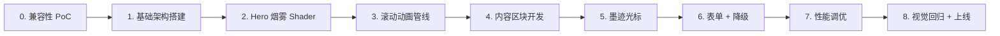

# 技术方案评审报告

## 1. 评审概述

- **项目名称**：lina-perfume-portfolio
- **评审日期**：2026-04-22
- **评审人**：Tech Lead Agent
- **评审文档**：
  - PRD：`.boss/lina-perfume-portfolio/prd.md`
  - 架构：`.boss/lina-perfume-portfolio/architecture.md`
  - UI 规范：`.boss/lina-perfume-portfolio/ui-spec.md`

## 摘要

> 下游 Agent 请优先阅读本节，需要细节时再查阅完整文档。

- **评审结论**：⚠️ 有条件通过
- **主要风险**：
  1. 🔴 Vite SPA + Three.js 重资源加载与 LCP < 2.5s 目标存在天然矛盾，首屏 JS budget 极其紧张
  2. 🔴 GSAP ScrollTrigger Club 版（SplitText）为付费组件，架构文档未明确授权成本
  3. 🟡 React 19 与 R3F v9 的兼容性尚需实证测试，Peer Dependency 冲突风险
  4. 🟡 iOS Safari 上 GSAP `pin: true` 已知 bug，Process 区横向滚动可能表现异常
- **必须解决**：见 §5.1 阻塞项（共 4 项）
- **建议优化**：见 §5.2 非阻塞优化建议（共 8 项）
- **技术债务**：JSON 配置层在作品数增长后的维护成本；SPA 无 SSR 导致 SEO 先天不足（可接受但需记录）

---

## 2. 评审结论

| 维度 | 评分 | 说明 |
|------|------|------|
| 架构合理性 | ⭐⭐⭐⭐ | 三层渲染管线分层清晰，职责隔离模式合理；但三套渲染系统共存本身即是复杂度来源，需在实施中严格边界 |
| 技术选型 | ⭐⭐⭐⭐ | Vite + R3F + GSAP 组合是业界验证过的方案；但 React 19 属前沿版本，R3F v9 兼容性需验证；GSAP SplitText 有授权成本 |
| 可扩展性 | ⭐⭐⭐ | JSON 配置层适合 6-12 件作品，超出后需考虑 CMS 化；纯前端无后端架构天然限制扩展空间 |
| 可维护性 | ⭐⭐⭐⭐ | Feature-based 目录组织优秀，shader 模块化清晰；但三套渲染管线调试成本高，需建立视觉测试流程 |
| 安全性 | ⭐⭐⭐ | 纯静态站点风险面较小，但 CSP 策略不完整（缺少 frame-ancestors、referrer-policy 等），formSpree 端点需环境变量隔离 |

**总体评价**：⚠️ 架构整体可行，设计思路专业，但在 **性能预算**、**第三方依赖兼容性**、**CSP 完整性** 三个维度存在需在开发前解决的阻塞项。建议进入 Stage 2（任务拆解）前先处理完 §5.1 阻塞项。

---

## 3. 技术风险评估

| 风险 | 等级 | 影响范围 | 缓解措施 |
|------|------|----------|----------|
| Three.js shader 低端设备帧率 < 30fps | 🔴 高 | Hero 区全用户 | 三级降级体系已设计；补充：需建立低端设备测试矩阵（iPhone SE / 低端 Android），实测验证降级效果 |
| Vite SPA 首屏加载与 LCP < 2.5s 矛盾 | 🔴 高 | 全站首屏 | React + Tailwind 首屏 bundle 需 ≤ 80KB gzip；Three.js chunk 延迟加载并配合 LoadingScreen；使用 `<link rel="modulepreload">` 预加载关键 chunk |
| GSAP ScrollTrigger + R3F useFrame 渲染管线竞争 | 🟡 中 | Hero 区动画流畅度 | 职责隔离方案合理；补充：需在 iOS Safari 上重点测试，Safari 的 rAF 行为与 Chrome 不同 |
| React 19 + R3F v9 兼容性 | 🟡 中 | 全站 R3F 组件 | 架构文档已提及需 peer dependency override；补充：项目初始化时第一时间做兼容性 PoC |
| iOS Safari GSAP pin: true 已知 bug | 🟡 中 | Process 区横向时间轴 | 架构文档已提及避免 pin 区域内使用 fixed；补充：考虑用 Lenis 平滑滚动库配合 CSS scroll-snap 作为备选方案 |
| 墨迹光标 Canvas 2D 性能开销 | 🟡 中 | 全站交互体验 | touch 设备已禁用；补充：桌面端也需限制绘制频率（requestAnimationFrame 节流至 30fps），避免 GPU 资源被光标占用 |
| GSAP SplitText 商业授权成本 | 🟡 中 | Hero 标题、About 文字动画 | 架构文档未提及费用（Club GSAP $99/年起）；建议评估是否可用 CSS clip-path + 自定义拆分替代 |
| formSpree 免费额度（50次/月） | 🟢 低 | Contact 区表单 | 告知 Lina 用量，超出后升级 $10/月；补充：前端增加提交频率限制（按钮 cooldown 10s） |
| 中文字体文件过大影响 LCP | 🟡 中 | 全站中文显示 | 子集化至 ≤ 200KB，font-display: swap；补充：使用 unicode-range 按需加载，避免一次性加载全部子集 |
| 首屏 JS bundle 超预算 | 🟡 中 | 全站性能 | 架构目标 < 150KB gzip 过于乐观；Three.js 单包即 ~200KB gzip，需严格延迟加载策略 |
| SPA 无 SSR 导致 SEO 弱 | 🟢 低 | 搜索引擎收录 | 纯作品集网站可接受；补充：确保关键内容在初始 HTML shell 中直出，不依赖 JS 渲染 |
| CSP 策略不完整 | 🟡 中 | 全站安全 | 当前 CSP 缺少 frame-ancestors、referrer-policy、permissions-policy；补充见 §5.1 |

---

## 4. 技术可行性分析

### 4.1 核心功能可行性

| 功能 | 可行性 | 复杂度 | 说明 |
|------|--------|--------|------|
| 朱砂烟雾 Hero Shader | ✅ 高 | 高 | 基于 Three.js Journey 社区方案，raymarching + FBM 成熟；难点在于 8 秒无缝循环和颜色渐变调优，预计需 3-5 天 shader 调试 |
| Film Grain 后处理 | ✅ 高 | 低 | @react-three/postprocessing 的 Noise effect 开箱即用，10 行代码即可实现 |
| GSAP ScrollTrigger 滚动动画 | ✅ 高 | 中 | ScrollTrigger 是业界最成熟的滚动动画方案；横向滚动 pin 需注意 iOS Safari 兼容性 |
| clip-path 卡片揭幕 | ✅ 高 | 低 | 现代浏览器支持良好；需测试 Safari iOS 的 clip-path inset 行为 |
| 墨迹 Canvas 2D 光标 | ✅ 高 | 中 | 技术无难点，关键在于调优墨迹晕染的视觉参数（大小、透明度、渐隐速度） |
| 横向滚动时间轴 | ✅ 高 | 中高 | GSAP pin + scrub 方案成熟；最复杂的是 anticipatePin 和 invalidateOnRefresh 的调参 |
| formSpree 表单集成 | ✅ 高 | 低 | @formspree/react SDK 封装完善，30 分钟内可完成集成 |
| React.Suspense 异步加载 Shader | ✅ 高 | 低 | React 19 原生支持 lazy + Suspense；需配合 LoadingScreen 做视觉过渡 |
| WebGL 三级降级体系 | ✅ 高 | 中 | 能力检测逻辑清晰；CSS 降级方案需提前设计静态视觉效果 |
| 页面加载过渡动画 | ✅ 高 | 低 | 纯 DOM 动画，GSAP context 管理即可 |
| 滚动进度指示器 | ✅ 中 | 中 | SVG 烟雾填充效果需额外开发，作为惊喜需求可 MVP 后迭代 |

### 4.2 技术难点

| 难点 | 解决方案 | 预估工时 |
|------|----------|----------|
| Volumetric Smoke Shader 调优 | 基于 Three.js Journey Coffee Smoke 方案二次开发，调整 FBM 参数、颜色渐变曲线、边缘衰减函数；预烘焙 noise texture 避免实时计算 | 3-5 天 |
| GSAP + R3F 管线隔离 | 已设计 ref 代理模式，需编写通用 `useGsapToR3FBridge` hook 封装此模式，确保全项目统一使用 | 1-2 天 |
| iOS Safari pin 兼容性 | 使用 `anticipatePin: 1` + `invalidateOnRefresh` + Lenis 平滑滚动；准备 CSS scroll-snap 备选方案 | 2-3 天 |
| 首屏性能优化 | Code splitting + modulepreload + 字体子集化 + 图片 lazy loading + LoadingScreen；需反复 Lighthouse 测试调优 | 3-4 天 |
| 多设备降级测试 | 建立测试矩阵（桌面 Chrome / Safari / Firefox + iPhone / Android 低端机），逐一验证降级效果 | 2-3 天 |

---

## 5. 架构改进建议

### 5.1 必须修改（阻塞项）

- [ ] **BLOCKER-1：完善 CSP 策略**
  
  当前 CSP 缺少以下关键指令，需在部署前补齐：
  ```
  frame-ancestors 'none';           // 禁止 iframe 嵌入
  referrer-policy strict-origin-when-cross-origin;  // 控制 referrer 泄露
  permissions-policy camera=(), microphone=(), geolocation=();  // 禁用不必要 API
  ```
  完整 CSP 应通过 `_headers` 文件注入，而非仅依赖 `vercel.json`。

- [ ] **BLOCKER-2：formSpree 端点环境变量隔离**
  
  PRD NFR-005 明确要求"不在前端代码中暴露 formspree 端点 URL"，但架构文档的 `BookingForm.tsx` 设计中未体现环境变量使用。需在 `vite.config.ts` 中配置 `VITE_FORMSPREE_ENDPOINT`，并通过 `.env` 文件管理，不得硬编码。

- [ ] **BLOCKER-3：GSAP SplitText 授权成本确认**
  
  架构文档中 `split-text` 等高级特性属于 GSAP Club 付费功能（$99/年起）。需在项目启动前确认：
  - Lina 是否接受此费用
  - 如不接受，需用 CSS + JS 方案替代（如 `split-type` 开源库）

- [ ] **BLOCKER-4：React 19 + R3F v9 兼容性 PoC**
  
  R3F v9 对 React 19 的支持尚在早期阶段。项目初始化后 **第一件事** 就是创建一个最小复现项目，验证：
  - `@react-three/fiber@9` + `react@19` + `@react-three/drei@10` 能否正常启动
  - `useFrame` 在 React 19 StrictMode 下的行为是否符合预期
  - 如不兼容，降级到 React 18 + R3F v8（稳定版）

### 5.2 建议优化（非阻塞）

- [ ] **SUGGESTION-1：增加 React Error Boundary**
  
  三套渲染系统中任何一套崩溃都不应导致整页白屏。建议在 `App.tsx` 顶层添加 Error Boundary，在 `SmokeScene` 和 `FilmGrain` 组件各添加独立 Error Boundary，捕获 R3F 渲染错误后触发 WebGL 降级。

- [ ] **SUGGESTION-2：引入 `use-resize-observer` 替代手动 resize 监听**
  
  架构中多处需要监听窗口尺寸变化（Canvas 光标尺寸、Shader resolution uniform），建议使用 `@juggle/resize-observer` 或自定义 hook，避免重复代码和内存泄漏风险。

- [ ] **SUGGESTION-3：Code Splitting 策略需更激进**
  
  架构文档中 `manualChunks` 将 three + fiber + drei 打包为单个 chunk（~200KB gzip），这个体积对于延迟加载仍偏大。建议：
  - `three` 核心库独立 chunk
  - `@react-three/drei` 按需 import（drei 支持 tree-shaking，不要全量导入）
  - 使用 `vite-plugin-inspect` 分析实际 chunk 体积

- [ ] **SUGGESTION-4：考虑 Vercel OG Image 动态生成**
  
  虽然项目为 SPA 无 SSR，但 Vercel 支持通过 `vercel/og` API 路由动态生成 Open Graph 图片。可为每件作品生成专属 OG 卡片，提升社交媒体传播效果（对应 PRD 潜在需求）。

- [ ] **SUGGESTION-5：建立视觉回归测试流程**
  
  Shader 和动画效果无法通过传统单元测试验证。建议使用 Chromatic 或 Percy 进行视觉回归测试，每次 shader 参数调整后自动截图对比，防止回归。

- [ ] **SUGGESTION-6：Lenis 平滑滚动与 GSAP ScrollTrigger 的集成需提前验证**
  
  架构文档引入了 `@studio-freight/lenis`，但 Lenis 与 ScrollTrigger 的集成需要额外配置（`Lenis.scrollTo` + `ScrollTrigger.update`）。建议在项目初始化阶段就完成集成 PoC。

- [ ] **SUGGESTION-7：补充 `loading="eager"` 与 `fetchpriority` 策略**
  
  Hero 区的 LCP 元素（标题文字）需标记 `fetchpriority="high"`，非首屏作品卡片标记 `loading="lazy"`。架构文档提到了图片策略，但对文本和字体资源的优先级策略不够详细。

- [ ] **SUGGESTION-8：考虑使用 `vite-plugin-pwa` 增加离线基础能力**
  
  虽然是作品集网站，但添加 Service Worker 缓存静态资源（字体、图片、JS chunk）可显著提升二次访问速度，且不影响首次加载性能。

---

## 6. 实施建议

### 6.1 开发顺序建议



**关键路径**：0 → 1 → 2 → 3 → 7（兼容性 PoC → 基础架构 → Shader → 动画管线 → 性能调优）

### 6.2 里程碑建议

| 里程碑 | 内容 | 建议工时 | 风险等级 |
|--------|------|----------|----------|
| M1: 地基（Week 1） | 项目初始化 + React 19/R3F 兼容性 PoC + 基础目录结构 + Vite 配置 + Tailwind 色板 | 3-4 天 | 🟡 中（兼容性 PoC 可能触发技术栈回退） |
| M2: 核心视觉（Week 2-3） | Hero Smoke Shader 开发 + Film Grain + LoadingScreen + 三级降级体系实现 | 5-7 天 | 🔴 高（Shader 调优耗时不确定，需反复迭代） |
| M3: 内容区块（Week 3-4） | About + Works + Process + Contact 区块开发 + GSAP 滚动动画集成 | 5-7 天 | 🟡 中（Process 区 pin 动画在 iOS 上需重点测试） |
| M4: 交互细节（Week 5） | 墨迹光标 + 导航栏 + 表单集成 + Error Boundary | 3-4 天 | 🟢 低 |
| M5: 性能与上线（Week 5-6） | Lighthouse 调优 + 降级测试矩阵 + CSP 配置 + 部署 | 3-4 天 | 🟡 中（LCP < 2.5s 目标需反复调优） |

**总预估工时**：3-4 周（1 名高级前端全栈）

### 6.3 技术债务预警

| 潜在债务 | 产生原因 | 建议处理时机 |
|----------|----------|--------------|
| JSON 配置层扩展性不足 | 当前设计假设作品数 < 12，超过后 JSON 文件膨胀、查找效率下降 | 作品数 > 10 时考虑迁移到 headless CMS（如 Sanity / Contentful） |
| SPA 无 SSR 导致 SEO 弱 | 架构决策明确放弃 SSR 以换取轻量；但作品详情页无法被搜索引擎独立索引 | 上线后如 SEO 效果不佳，可迁移至 Astro（静态生成 + 部分 hydration） |
| GSAP Club 依赖 | 如果使用了 SplitText 等付费功能，后续维护需持续付费 | 如预算紧张，在 M1 阶段用开源方案替代 |
| 手动 WebGL 降级检测 | 当前降级逻辑基于 UA sniffing + 简单的 WebGL 能力检测，不够精准 | 二期引入 `gpuinfo` API 或更细粒度的性能基准测试 |

---

## 7. 代码规范建议

### 7.1 目录结构规范

架构文档的 Feature-based 目录组织总体合理，补充以下规范：

```
lina-perfume-portfolio/
├── src/
│   ├── components/               # 共享基础组件（跨 section 复用）
│   │   └── <ComponentName>/
│   │       ├── <ComponentName>.tsx
│   │       ├── <ComponentName>.module.css    # 如需局部样式
│   │       ├── <ComponentName>.stories.tsx   # Storybook（可选）
│   │       └── index.ts                      # barrel export
│   │
│   ├── sections/                 # 页面区块（单 section 专用）
│   │   └── <SectionName>/
│   │       ├── <SectionName>.tsx
│   │       ├── use<SectionName>Animation.ts  # 该 section 动画 hook
│   │       └── index.ts
│   │
│   ├── hooks/                    # 通用 hooks（跨 section 复用）
│   │   ├── useWebGLSupport.ts
│   │   └── index.ts
│   │
│   ├── shaders/                  # 全局 shader 资源
│   │   ├── common/             # 可复用的 glsl 函数
│   │   └── <ShaderName>/       # 按 shader 模块组织
│   │       ├── <ShaderName>.vert.glsl
│   │       ├── <ShaderName>.frag.glsl
│   │       └── <ShaderName>Material.ts
│   │
│   ├── config/                   # 数据配置层
│   │   └── index.ts            # 统一导出 + 类型
│   │
│   ├── styles/                   # 全局样式
│   │   ├── globals.css
│   │   └── tokens.css
│   │
│   ├── types/                    # 全局类型定义
│   │   └── index.ts
│   │
│   └── utils/                    # 纯工具函数（无副作用）
│       └── index.ts
```

**关键原则**：
- 每个目录必须有 `index.ts` barrel export，统一外部引用路径
- 组件文件与组件同名（`InkCursor/InkCursor.tsx`），避免同名冲突
- `.glsl` 文件按 shader 模块组织在 `shaders/` 下，而非散落在各 section

### 7.2 命名规范

- **文件命名**：PascalCase（组件：`InkCursor.tsx`），camelCase（hooks：`useWebGLSupport.ts`，utils：`perf.ts`），kebab-case（样式：`globals.css`）
- **组件命名**：PascalCase，功能描述性（`SmokeScene` 而非 `Scene`）
- **Hook 命名**：必须以 `use` 开头，描述行为而非实现（`useReducedMotion` 而非 `useMediaQuery`）
- **变量命名**：camelCase；常量使用 UPPER_SNAKE_CASE（如 `SMOKE_LOOP_DURATION = 8`）
- **Shader uniforms**：统一 `u` 前缀（`uTime`、`uOpacity`），与架构文档一致
- **CSS 类名**：Tailwind 原子类为主，自定义类名使用 kebab-case（`.ink-cursor`）

### 7.3 代码风格

- **TypeScript 严格模式**：`"strict": true`，禁止 `any` 类型（使用 `unknown` 替代），所有 shader uniforms 必须有类型定义
- **组件规范**：函数组件优先，不使用 class 组件；每个组件必须有明确的 props 类型接口
- **ESLint 规则**：
  - `@typescript-eslint/no-explicit-any`: error
  - `@typescript-eslint/no-unused-vars`: warn
  - `react-hooks/rules-of-hooks`: error
  - `react-hooks/exhaustive-deps`: warn
  - `import/order`: 按类型分组（react → external → internal → types）
- **注释规范**：
  - Shader 代码必须有逐行注释（GLSL 可读性差，注释至关重要）
  - 每个自定义 hook 顶部必须有 JSDoc 说明用途、返回值、副作用
  - GSAP 动画代码必须标注触发条件、持续时间、easing
- **Git 提交规范**：Conventional Commits（`feat:`, `fix:`, `style:`, `refactor:`, `perf:`, `test:`, `chore:`）
- **Prettier 配置**：`printWidth: 100`, `semi: true`, `singleQuote: true`, `trailingComma: 'es5'`

### 7.4 补充：R3F 专项规范

- **useFrame 使用**：每个 `useFrame` 回调必须声明优先级参数（`useFrame((_, delta) => {}, priority)`），避免多个 useFrame 无序执行
- **React 19 StrictMode 兼容**：所有 GSAP 动画必须包裹在 `gsap.context()` 中，所有 R3F 组件的 ref 初始化必须处理 StrictMode 的双次调用
- **Three.js 对象清理**：组件卸载时必须 dispose geometry、material、texture，避免 WebGL 内存泄漏

---

## 8. 评审结论

- **是否通过**：⚠️ 有条件通过（需解决 4 项阻塞项后进入开发）
- **阻塞问题数**：4 个
- **建议优化数**：8 个
- **下一步行动**：
  1. 优先处理 BLOCKER-4（React 19 + R3F 兼容性 PoC），决定技术栈是否回退
  2. 确认 BLOCKER-3（GSAP 授权成本），决定是否替换 SplitText
  3. BLOCKER-1 和 BLOCKER-2 可在 M1 地基阶段同步修复
  4. 所有阻塞项解决后，进入 Stage 2：任务拆解 + 开发排期

### 评审人签字

> Tech Lead Agent — 2026-04-22
> 
> 评审意见已反馈至架构团队，建议在 Scrum Master 任务拆解前完成阻塞项修复。架构整体思路清晰，Feature-based 组织和三级降级体系体现了专业水平。重点关注 Shader 调优耗时和 iOS 兼容性，这两项是项目延期的最大风险源。

---

_专业评审完毕，祝项目顺利。_ 👔
